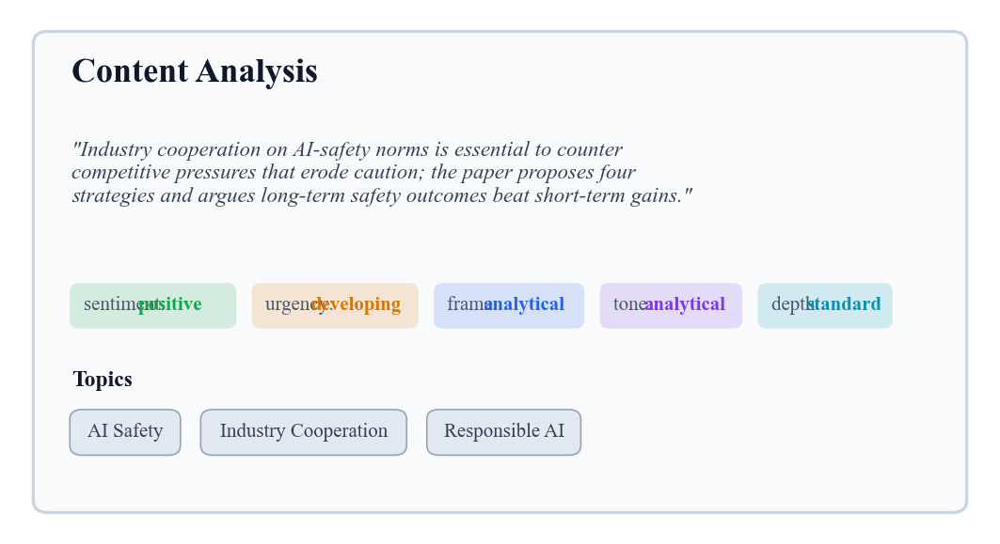
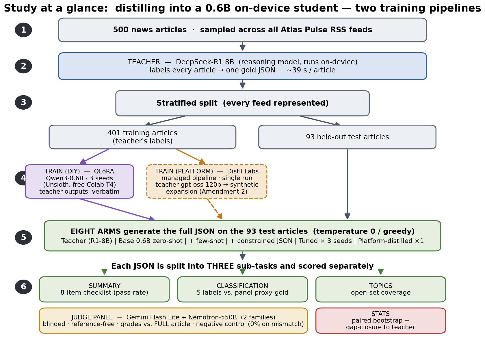
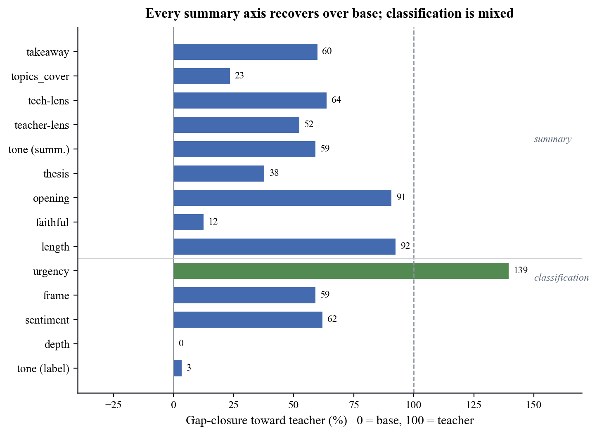
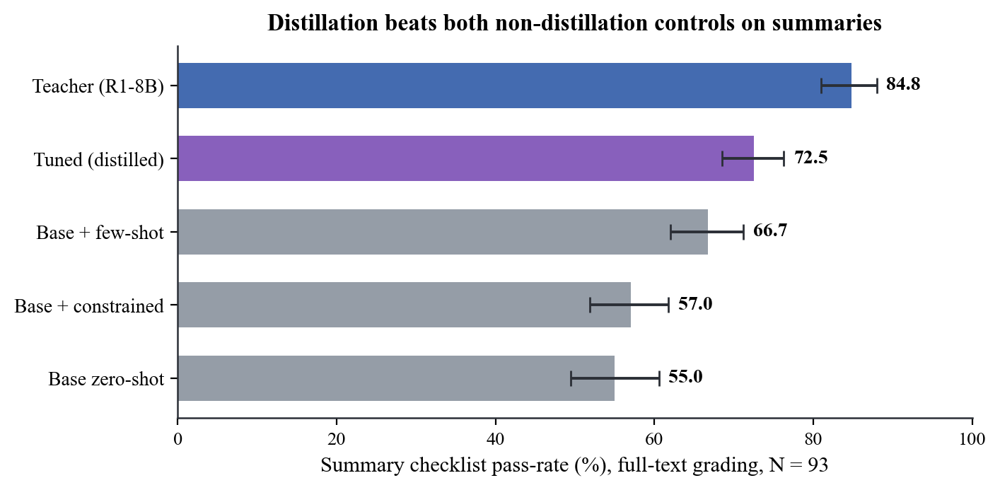
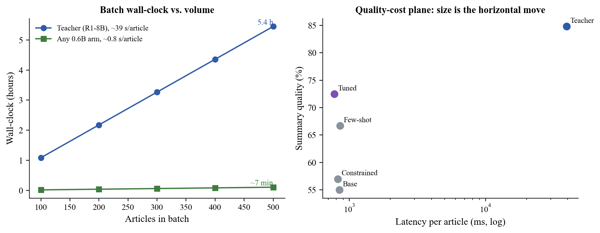

# Fast and Faithful? Distilling an 8B Reasoning Teacher into a Sub-1B On-Device Student for Structured News Enrichment

*A pre-specified, per-field quantification of what distillation buys: DeepSeek-R1 → Qwen3-0.6B under a multi-judge, control-anchored evaluation*

**Vinay Kumar Chaganti**  
Independent researcher · cvk.atreya@gmail.com  
July 2026 · Preprint

**Scope of claims.** All results are from full-text judge grading with a two-judge panel (Gemini Flash Lite + Nemotron-550B) on N = 93 held-out articles. Every directional finding is confirmed by each judge independently (§7); exact magnitudes are judge-dependent (§10).

---

## Abstract

What does knowledge distillation actually buy a production pipeline — measured per sub-task, against the cheaper levers a practitioner would try first, at claims the evidence can support? I quantify this on a real, shipped deployment: an RSS reader that enriches each article with a structured JSON summary, run as a local batch job, at the output quality of an 8B reasoning model (`deepseek-r1:8b`) but without its ~39 s/article latency (a 500-article backlog took 5.4 hours). I fine-tune a 600M-parameter Qwen3-0.6B student on the teacher's outputs (QLoRA, 3 seeds) and ask not "does distillation work" but the question the goal poses: **how much of the teacher's quality did the small student recover, on which parts of the task, and at what cost to the properties a news product cannot compromise?**

I separate the single JSON output into its three real sub-tasks — a free-text summary, five categorical labels, and open-set topics — and score each against two non-distillation controls (few-shot prompting; constrained JSON decoding), with a blinded, reference-free, multi-family LLM-judge panel that grades against the *full* article and is validated by a negative control (0% faithful on mismatched articles, n = 30). Latency is measured per-arm on the test set.

The speed target is met and is a property of model size: every 0.6B arm runs at ~0.8 s/article, collapsing the 5.4 h batch to ~7 minutes at ~11× less RAM and zero cost. The quality target is met substantially but unevenly. Reframing every metric as **gap-closure toward the teacher** (base = 0%, teacher = 100%), distillation closes ~59% of the summary-quality gap and ~50% of the classification gap. On the aggregate summary checklist the tuned student significantly beats both non-distillation controls — constrained decoding (+15.5 pts, p < 0.001) and few-shot prompting (+5.9 pts, p < 0.001) — so the summary gain is distillation-specific, not merely formatting or in-context imitation. Classification is more mixed: on *urgency* the tuned student tops every arm including the teacher in judge agreement (78% vs 57%) — though a per-class analysis attributes most of that margin to majority-class alignment (+4.3 points over always guessing the dominant label, §6.3) — and it beats both controls on *frame*, but on the classification macro it only ties few-shot (56.0 vs 57.8) and barely moves *tone* labeling (29% vs few-shot's 79%). The one summary soft spot is faithfulness: the tuned student sits ~4 points below the untuned base (75.6% vs 79.6%; teacher 93.5%), and that gap is concentrated in short-source articles (−21 pts on articles ≤ 1200 chars; level with base on longer ones) — a thin-source fabrication tendency, not general hallucination.

The actionable result is a **per-field engine assignment**: the distilled student is the best on-device choice for structure, for *urgency* / *frame*, and for summaries of substantial articles; prompting wins *tone*; and faithfulness-critical prose on thin sources should fall back to prompting or the teacher. I also report material seed variance (tone-labeling ranged 8.6–46.2% across three training seeds) that a single run could not have surfaced.

---

## 1. Introduction

This study began as a quantification problem: before adopting distillation across a family of production tasks, I wanted a defensible measurement of what it actually buys — per sub-task, against the cheaper levers a practitioner would try first. The task pattern under study — one prompt, one schema-bound JSON object per item, repeated over thousands of items — recurs across production pipelines (ticket triage, log classification, document intake, catalog extraction), so the lessons were expected to outlive the first application.

That first application is real and shipped. **Atlas Pulse** — a local-first RSS reader — enriches every incoming article with a structured JSON object: a short analytical summary, five closed-vocabulary content-analysis labels — *sentiment* (positive/neutral/negative), *urgency* (breaking/developing/evergreen), *frame*, *tone*, and *depth* — and open-set topic tags (full vocabularies in §3). Generating that with the `deepseek-r1:8b` teacher produced output I was happy with, but at ~39 s/article; enriching a 500-article backlog was a 5.4-hour job on a consumer MacBook (Figure 5, left). The engineering goal was to keep that output quality while making the batch fast enough to run locally as a routine, unattended job.

Running the study fully locally was itself a measurement decision, not only a deployment constraint. Free-tier hosted APIs proved too unreliable for controlled quantification — rate limits and dropped completions later forced even the judge panel down to the two providers that ran cleanly (§5.2) — whereas local models hold still: fixed weights, temperature 0, no quotas, unlimited reruns. Everything needed to re-measure is therefore local and free.

Two levers were available, and it is worth being precise about which does what, because the two are easy to conflate.

- **Model size buys speed.** A 0.6B model runs ~40× faster than the 8B teacher regardless of how it was trained. This lever is free and was never in question.
- **Distillation buys quality at that size** — it is the only lever that can make a 0.6B model produce output resembling the teacher's. This is the lever under test.

So the real question is not "is the small model faster" (trivially yes) nor "was distillation worth it" (worth it *for what?*), but:

> **How much of an 8B teacher's output quality can a 600M student recover through distillation — on each part of a structured task — and does it preserve the properties (faithfulness above all) that a reader-facing product cannot compromise?**

An earlier internal pass answered a cruder version ("distillation matched or exceeded the teacher") with a method that could not support it: a single same-generation judge, N = 20, a 0–5 rubric that saturated at 4.95 on faithfulness, and one training run. This paper re-runs the question with a design that closes each of those gaps: 93 test articles, seven arms including two non-distillation controls, a decomposition into three sub-tasks, a multi-family judge panel validated by a negative control, three training seeds, and paired-bootstrap significance tests. The checklist and primary comparison were **fixed after a pilot and before scoring** (`evaluation_design.md`, `PREREGISTRATION.md`), so the summary rubric could not be tuned to the result.

### 1.1 Contributions

1. **A fully-local, reference-free, human-free evaluation harness** for structured-output distillation — negative-control grader validation, direction-only multi-judge reporting, reproducible offline from a cached judge log — built so the measurement itself repeats across the future use cases the task pattern implies.
2. **Gap-closure-to-teacher as a reporting scale** matched to the actual engineering goal (teacher quality at student speed), which naturally exposes both overshoot and regression.
3. **A per-sub-task decomposition** of a single structured-output distillation, separating free-text summarization, categorical classification, and open-set topic tagging — which reveals effects that any aggregate score hides: an *urgency* agreement score above the teacher's (largely majority-class alignment, per the §6.3 confusion analysis), a faithfulness regression confined to short source articles, and one label field (*tone*) that fine-tuning barely moves while prompting handles it well.
4. **Two non-distillation controls** (few-shot prompting; constrained decoding) so distillation is credited only for what neither cheaper lever provides — the tuned student significantly beats both on summary quality.
5. **A practitioner-facing result**: a per-field engine assignment for on-device structured enrichment, and an explicit map of the build decisions the exercise required — teacher and student choice, quantization, tuning recipe, data size, task decomposition, controls, judging (§9.1).

**What this paper does *not* claim** (stated once, up front, and revisited in §10): it does not establish that the teacher's *reasoning* nature was necessary; it does not use human gold labels; it uses a two-judge panel, so exact magnitudes are not judge-invariant; and its classification "accuracy" is measured against a judge-panel consensus, not ground truth.

## 2. Related work

**Knowledge distillation.** Training a small "student" to imitate a larger "teacher" dates to Hinton et al. (2015), with sequence-level distillation for generation introduced by Kim & Rush (2016). The modern LLM variant — a large model generates outputs on which a smaller model is supervised-fine-tuned — is what surveys term black-box or sequence-level KD (Xu et al. 2024; Zhu et al. 2023). The pipeline here is a textbook instance: the teacher labels, the student is SFT'd on those labels. What distinguishes this study is not the method but the measurement — most KD work reports a single aggregate quality delta, whereas I decompose by sub-task and control for cheaper alternatives.

**Rationale over labels.** A parallel line supervises the student on the teacher's *reasoning*, not just its answers. "Distilling step-by-step" (Hsieh et al. 2023) shows rationale supervision is more data-efficient than label-only; Symbolic CoT Distillation (Li et al. 2023) shows sub-1.3B students can absorb chain-of-thought. I deliberately train on the teacher's final outputs only (thinking disabled), both because these tasks are non-reasoning and because it is the deployment-realistic recipe; whether trace supervision would help here is left as future work (§11).

**Reasoning-teacher distillation after DeepSeek-R1.** DeepSeek-R1 (DeepSeek-AI 2025) showed that distilling a strong reasoning model into smaller dense models transfers reasoning ability, triggering a wave of replication studies (Zhang et al. 2025, *100 Days After DeepSeek-R1*). That literature is almost entirely about math, code, and reasoning benchmarks at the 1.5B–32B scale. NaturalThoughts (Li et al. 2025) frames the System-1 (answer-only) vs System-2 (trace) distillation axis directly, and — relevant to the open question here — studies equal-size non-reasoning students (Llama-3.1-8B, Qwen2.5-7B). This setting sits in the gap that leaves: a reasoning teacher distilled into a **sub-1B** student for **non-reasoning production tasks** (summarization, classification), where the recipe's value is contested rather than assumed.

**Reasoning can hurt.** The assumption that a reasoning teacher helps is not safe for simple tasks. OptimalThinkingBench (Aggarwal et al. 2025) documents that thinking models distilled into non-thinking students can degrade on straightforward queries — "overthinking" transfers through distillation. The faithfulness regression reported here (§6.2) is an independent data point in this direction: the teacher's *style* transferred faster than its *carefulness*.

**Small models and their limits.** Qwen3 (Yang et al. 2025) is itself a strong-to-weak distillation product; Qwen3-0.6B is at the low edge where CoT distillation is known to become unreliable. Speculative KD (Xu et al. 2024) already covers 0.5B-class students on summarization, but via on-policy methods and without the per-field, controlled decomposition used here.

**LLM-as-judge and faithfulness evaluation.** Scalar LLM judging (G-Eval, Liu et al. 2023; FLASK, Ye et al. 2023) is known to suffer positional, verbosity, and style biases and to saturate near the ceiling — exactly what sank the earlier 0–5 rubric. The field's response is decomposition: checklist-based judging (CheckEval, Lee et al. 2024) and open-rubric judges (Prometheus 2, Kim et al. 2024). For faithfulness specifically, atomic-fact methods (FActScore, Min et al. 2023; RAGChecker, 2024) and efficient local entailment checkers (MiniCheck, Tang et al. 2024) replace n-gram overlap; SelfCheckGPT (Manakul et al. 2023) detects hallucination reference-free. Instance-specific rubrics are the current frontier (HealthBench, OpenAI 2025). The harness here adopts the checklist-decomposition and reference-free-validation lessons from this line while staying fully local and human-free (§5).

**A note on what is actually being distilled.** `deepseek-r1:8b` (Ollama) is DeepSeek-R1-Distill-Llama-8B — itself an SFT-distilled dense model derived from the 671B R1 (DeepSeek-AI 2025) — and Qwen3-0.6B is itself a distillation product. The pipeline is therefore **third-order distillation**, which caps the achievable ceiling and is stated explicitly (§10).

## 3. The task: structured article enrichment

Before the method, what the models actually produce — and what it is for. Atlas Pulse enriches every incoming article with one JSON object carrying seven fields: a free-text summary, five categorical labels, and an open-set topic list. These are not abstract benchmark labels — they surface directly in the reader's UI as a content-analysis panel the user sees on every article (Figure 1).



**Figure 1.** The enrichment as the reader sees it — a real Atlas Pulse screenshot. The five categorical fields (`sentiment`, `urgency`, `frame`, `tone`, `depth`) and topic tags render as badges in the "Content Analysis" panel; the free-text summary lives on the adjacent Summary tab. A hallucinated *summary* misleads the reader, whereas a mislabelled *badge* is glanceable and cheap — the asymmetry that motivates the per-field engine assignment.

A representative teacher output for one article:

```json
{
  "summary": "The paper argues industry cooperation on AI-safety norms is
              essential to counter competitive pressures that erode caution...",
  "sentiment": "positive",
  "urgency": "developing",
  "frame": "analytical",
  "tone": "analytical",
  "depth": "standard",
  "topics": ["AI Safety", "Industry Cooperation", "Responsible AI"]
}
```

The categorical fields draw from small closed vocabularies observed in the teacher's own labels: *sentiment* ∈ {positive, neutral, negative}; *urgency* ∈ {breaking, developing, evergreen}; *frame* ∈ {analytical, conflict, human_interest, economic}; *tone* ∈ {analytical, optimistic, opinion, alarming}; *depth* ∈ {brief, standard, deep_dive}. **Several vocabularies are imbalanced** (e.g. *depth*: 56% standard, 26% brief, 2% deep_dive), which matters directly for interpreting per-field accuracy — a point made concrete with a majority-class baseline in §6.3.

This single output is really **three ML problems with different success criteria** — and scoring them together hides what distillation moved:

| Sub-task | Fields | Type | Failure cost in the product |
|---|---|---|---|
| **Summarization** | `summary` | free-text generation | **high** — a hallucinated summary misleads the reader |
| **Classification** | `sentiment, urgency, frame, tone, depth` | closed-set labels | **low** — a mislabeled badge is cheap and correctable |
| **Topic tagging** | `topics` | open-set multi-label | **low** — affects filtering/search, not comprehension |

The asymmetry in the last column is the reason the study's conclusion is a **per-field engine assignment** (§8) rather than a single verdict: the quality bar a field must clear depends on what a wrong value costs. A hallucinated *summary* misleads the reader; a mislabeled *urgency* badge is glanceable and cheap.

## 4. Experimental setup



**Figure 2.** Overview of the experimental pipeline. 500 articles are labeled by the teacher and split 401/93; the student is fine-tuned on the training labels (three seeds); seven arms generate outputs on the held-out test set; each output is scored on three sub-tasks by a two-judge panel; results are reported as gap-closure toward the teacher.

### 4.1 Models

| Role | Model | ~Params | Runtime |
|---|---|---|---|
| Teacher | DeepSeek-R1 8B (`deepseek-r1:8b`) | 8B | Ollama, on-device (Q4_K_M) |
| Student | Qwen3-0.6B | 0.6B | Ollama, on-device (Q4_K_M) |

A ~13× parameter gap and a difference in kind: DeepSeek-R1 emits chain-of-thought (`<think>`) before answering; the student is trained on the teacher's **final outputs only**, compiling task knowledge into weights and skipping runtime deliberation. This choice is deliberate and deployment-realistic — but it is also why this study cannot separate "reasoning teacher" from "capable 8B teacher" (§10).

### 4.2 Data and split

500 articles sampled fairly across all feeds; the teacher generates a gold JSON for each; malformed outputs dropped. Stratified-random split: **401 train / 93 test** (`data/eval/split.json`), every feed represented. The test set is *new articles from known feeds* — matching deployment (the reader follows fixed feeds and sees new items), not generalization to unseen sources, which is out of scope and stated as such (§10).

### 4.3 Training

QLoRA fine-tune of Qwen3-0.6B directly on the 401 teacher outputs via Unsloth (LoRA rank 32, response-only loss masking, Qwen3 "thinking" disabled), on a free Colab T4. **Three seeds** (42 / 123 / 7) → `rss-tuned-s1/s2/s3`, so seed variance is *characterized* rather than assumed away. Exported to q4_k_m GGUF, served locally in Ollama.

### 4.4 The seven arms (all generated at temperature 0 / greedy)

| Arm | Role |
|---|---|
| **Teacher** `deepseek-r1:8b` | quality target (not assumed a ceiling) |
| **Base** Qwen3-0.6B | zero-shot floor / starting point |
| **Base + few-shot** (2–3 in-context examples) | control: is the win just prompting? |
| **Base + constrained decoding** (JSON-schema-forced) | control: is the win just formatting? |
| **Tuned × 3 seeds** | the distillation method |

Temperature 0 everywhere, so the only characterized variance is the tuned model's three training seeds — exactly what the confidence intervals capture. Distillation is credited only where it beats **both** controls on something real. All arms see the full article at generation time.

## 5. Evaluation method

The design below (metrics, checklist, controls, split, seeds, primary comparison) was fixed after a 12-article pilot and before any scored run, and not revised after seeing results — so the summary rubric could not be tuned to the result. The freeze is a self-archived analysis plan recorded in version control (`PREREGISTRATION.md`), not an entry in an external registry such as OSF, so its timestamps are self-attested; deviations from it are disclosed where they occur (§5.2, §10). The exact checklist wording and judge prompts are in Appendix A.

### 5.1 Metrics per sub-task

- **Structure** — schema validity %: parses as JSON with all 7 fields. Deterministic, no judge.
- **Classification** — per-field accuracy + macro-average vs. panel-consensus proxy-gold (see §5.2 for how consensus is resolved on a two-judge panel, and §6.3 for the majority-class baseline against which accuracy must be read).
- **Summarization** — an **8-item binary checklist** (pass-rate), the primary metric, chosen because the earlier 0–5 rubric saturated. The eight checks are *faithful, thesis, takeaway, length (3–4 sentences), opening (does not begin "This/The article"), teacher-lens, tech-lens, tone*, plus a separately-reported *topics_cover* check. All are graded by the LLM panel. (*length* and *opening* are simple enough to compute by rule; that they were graded by judge instead is a known inefficiency — §10.)
- **Efficiency** — latency p50/p95, throughput, output tokens, RAM — measured per-arm on the test set (§6.5).

### 5.2 Judge panel and grading

Reference-free grading **against the full article**, never against the teacher's answer (avoids teacher-mimicry bias); blinded (shuffled anonymous arm labels); temperature 0. The panel deliberately excludes the teacher's family (DeepSeek) and the student's family (Qwen) — a same-family judge can self-prefer in either direction.

The results reported here come from a **two-judge panel**, Gemini Flash Lite + Nemotron-550B (two distinct families, N = 93). Per-check inter-judge disagreement is **26.8%**, so I report each judge's *direction* independently (§7) rather than hiding disagreement inside a majority vote. For the classification proxy-gold, where a single label per field is required, ties on the ~27% of items where the two judges disagree are broken deterministically by a fixed judge-priority order (Gemini first); this is a **known limitation** — a two-judge "consensus" has no true majority on disagreements, so the resulting accuracy numbers inherit the tiebreak judge's biases and should be read as directional, not exact (§10).

I initially graded with a larger panel that included Groq-hosted judges (`gpt-oss-120b` and Llama models), but those proved unreliable mid-run — frequent request failures and dropped completions on the free tier — while Gemini Flash Lite and Nemotron-550B ran cleanly to completion across all 93 items. I therefore report the two judges that graded reliably. **This is a deviation from the preregistered multi-family panel**, made for operational reasons and flagged as such (§10).

**Judge context is the full article.** An earlier pass trimmed the article the judges saw to the first 1200 characters (a free-tier token-budget compromise, not a design choice). I found this *systematically understated faithfulness* and re-graded — both the summary checklist and the classification proxy-gold — with the complete article. Full-text grading is canonical throughout this paper; §6.2.1 quantifies the difference and §7 draws the methodological lesson.

### 5.3 Grader validation without humans

At this scale, human adjudication is the bottleneck, so the grader is validated by construction: a **negative control** grades a sample of summaries against a *mismatched* article. A grader that cannot tell a real summary from a mismatched one is not measuring anything. Result: **0% faithful on mismatched articles (n = 30)** — the grader demonstrably discriminates the gross case.

To be explicit about what this does and does not validate: It confirms the judge is reading the article rather than rating surface plausibility. It does **not** confirm the judge catches *subtle, in-domain* fabrication — a plausible invented detail inside an otherwise-correct summary (the exact failure mode of §6.7, Example B). Validating detection of that finer case would require injected-fabrication tests or a small human-labeled set, and is left as future work (§11). The faithfulness numbers should be read with that boundary in mind.

### 5.4 Statistics

All metrics as mean ± 95% CI (bootstrap over the 93 test items; the headline arm comparisons use a **paired bootstrap** over per-article scores, 20,000 resamples, which cancels per-article difficulty). Tuned metrics are reported as the mean across 3 seeds. **Primary comparison** (fixed before scoring): tuned vs. base+constrained, on checklist pass-rate. **Secondary** (not headline): tuned vs. base, tuned vs. few-shot, and the per-field classification comparisons. These secondary comparisons are numerous (≈15 across fields and checks); given the seed variance documented in §6.6, individual secondary "wins" that are not also confirmed by both judges (§7) should be treated as suggestive rather than established. Non-significant differences are reported as such.

A note on the confidence intervals: the per-article bootstrap captures *article*-level sampling variance around the 3-seed mean. It does **not** fully propagate *training-seed* variance, which §6.6 shows is first-order on the subjective fields. Where seed spread is large (tone, classification macro), the seed range in §6.6 — not the bootstrap CI — is the more representative measure of uncertainty.

## 6. Results

### 6.1 Gap-closure toward the teacher

Because the goal was teacher quality at student speed, the natural scale is **how far the student traveled from the untuned base (0%) toward the teacher (100%)** on each axis: `(tuned − base) / (teacher − base)`. Figure 3 is the paper in one chart.



**Figure 3.** Per-axis gap-closure toward the teacher (0 = untuned base, 100 = teacher). Blue = partial recovery; green = beat or overshot the teacher; red = regressed below base. Distillation recovers most summary and classification axes, overshoots two (opening, urgency), and leaves two small summary regressions (faithful, length). urgency exceeds the teacher's agreement score (the per-class analysis in §6.3 tempers this). The per-axis pattern, rather than any single aggregate, is the primary result.

The headline is not one number; it is the *shape*: distillation recovered most of the teacher's quality on most summary axes, exceeded it on two, and left two small summary regressions — faithfulness and length. On classification the picture is more mixed (§6.3). The faithfulness regression is the axis this product's risk threshold cares about, and §6.2.1 shows it is small (−4 pts) and confined to short-source articles.

**A caution about the scale itself.** Gap-closure is a *ratio*, and it becomes unstable when the teacher and base are close (a small denominator). Two axes illustrate this: *depth* has a base→teacher gap of only ~11 points, and *opening* shows a "122% overshoot" that is really a stylistic quirk on which the teacher itself scores low (73.1). I therefore report **absolute deltas alongside every gap-closure figure** below and flag the axes where teacher ≈ base, so the reader can tell a load-bearing percentage from a ratio artifact. Relatedly, because the student can exceed 100% on some axes, the teacher is a *reference point, not a ceiling* — the scale's endpoints are labels of convenience, not physical limits.

### 6.2 Summarization

All numbers here are from full-text grading. Checklist pass-rate (primary metric), N = 93, mean of 3 tuned seeds; CIs are per-article bootstrap.



**Figure 4.** Summary checklist pass-rate by arm, full-text grading, mean ± bootstrap 95% CI (N = 93). The tuned student significantly beats both non-distillation controls on the paired per-article test — constrained decoding (+15.5) and few-shot (+5.9). The marginal CIs for tuned and few-shot overlap slightly; the win rests on the paired comparison, which cancels per-article difficulty, not on marginal-CI separation.

| Arm | Checklist % | 95% CI |
|---|---|---|
| Teacher | 84.8 | [81.0, 88.0] |
| **Tuned (distilled)** | **72.5** | **[68.5, 76.3]** |
| Base + few-shot | 66.7 | [62.0, 71.2] |
| Base + constrained | 57.0 | [51.9, 61.8] |
| Base zero-shot | 55.0 | [49.5, 60.6] |

The **primary comparison** (tuned vs. base+constrained) is a decisive, significant win: **72.5 vs 57.0, +15.5 points** paired-bootstrap [11.1, 20.3], p < 0.001 — and it holds for each of the three seeds independently. Distillation also beats the prompting control significantly: **72.5 vs 66.7, +5.9** [2.5, 9.5], p < 0.001. So the summary gain survives both controls a reviewer would demand: it is not reducible to schema-formatting or to showing the model a few examples. Overall the tuned student closes **59% of the base→teacher summary gap.**

The per-check breakdown shows *where* — and, importantly, separates the product-critical **faithfulness** axis from the stylistic/quality axes rather than letting an 8-way average blend them:

| Check | Base | Few-shot | Tuned μ | Teacher | Absolute Δ (tuned−base) | What distillation did |
|---|---|---|---|---|---|---|
| **faithful** | 79.6 | 83.9 | **75.6** | 93.5 | **−4.0** | mild regression (−29% gap-closure) |
| takeaway | 44.1 | 47.3 | 74.2 | 89.2 | +30.1 | large gain (67% closure) |
| teacher-lens | 22.6 | 41.9 | 62.0 | 87.1 | +39.4 | recovered ~61% |
| tech-lens | 36.6 | 44.1 | 54.5 | 63.4 | +17.9 | recovered ~67% |
| tone | 59.1 | 80.6 | 82.8 | 92.5 | +23.7 | recovered ~71% |
| opening | 51.6 | 79.6 | 77.8 | 73.1 | +26.2 | overshot teacher (small base→teacher gap) |
| thesis | 84.9 | 91.4 | 94.2 | 97.8 | +9.3 | near teacher (72%) |
| length | 61.3 | 64.5 | 59.1 | 81.7 | −2.2 | mild regression (−11%) |
| topics_cover | 87.1 | 95.7 | 95.7 | 98.9 | +8.6 | recovered ~73% |

The gains are broad — specificity (*takeaway* 44→74), the three persona lenses, tone, and opening style all recover most of the way to the teacher, and two axes overshoot it. The two soft spots are **faithfulness (−4)** and **length adherence (−2)**. (The length miss is over-compression, not rambling: seeds 1 and 3 write fewer than three sentences on ~52% of items and never more than four; seed 2 sits at 31% — seed variance again. It is the same style-transfer overshoot that makes the tuned arm the fastest, §6.5.) Because failure costs are asymmetric (§3), I do not fold faithfulness into a single "the student is better" headline — the aggregate checklist win is driven by the style and specificity checks, *while* the one product-critical property regressed slightly. That tension is the central result of this section; §6.2.1 examines it.

### 6.2.1 The faithfulness gap

Under full-text grading, faithfulness is base 79.6, tuned 75.6, teacher 93.5. So the tuned student sits slightly *below* the untuned base — a **−4 point gap** (equivalently −29% in gap-closure terms). Two things resolve what is real.

**(a) The earlier lead-only pass exaggerated the regression.** Grading against only the first 1200 characters penalized *every* arm's summaries for claims supported deeper in the article — depressing absolute faithfulness by +25 to +35 points when corrected (base +30.1, tuned +35.1, teacher +24.7, few-shot +25.8). Crucially the uplift appears for every arm, so it is a property of the *grading setup*, not of any model. Because the tuned student writes more specific claims, it was penalized hardest by truncation, which inflated its apparent regression from −4 pts (full-text) to −9 pts (lead-only) — the latter being −47% in gap-closure terms, the number an earlier draft reported.

**(b) What remains is real, and it is localized — on a small subgroup.** Splitting the full-text scores by article length: on **long articles** (>1200 chars, n = 71) the tuned student is level with base (81.7 vs 80.3, +1.4). The entire residual regression concentrates in **short articles** (≤1200 chars, **n = 22**), where tuned drops to 56.0 vs base 77.3 (−21.3) — and on those, lead and full context are identical, so truncation cannot explain it. **The sample size warrants caution:** −21 points on 22 articles, split three ways by seed, is a real signal but a wide one; I say "concentrated in short sources," not "confined to exactly this," and the effect would benefit from more short-source items and an entailment check (§11). The mechanism is plausible and consistent across seeds: given little article to work with, the distilled student fills the summary with specific-sounding but unsupported claims (Example B, §6.7). On rich source material it stays grounded.

**Taken together:** distillation recovered most of the teacher's summary quality (59% of the gap; significant wins over both controls), with a small faithfulness cost concentrated in short-source articles. For a reader-facing product that cannot tolerate fabrication, even a localized dip is worth routing around (§8) — but this is a narrow, characterized failure mode, not the blanket "distillation makes the student hallucinate" the raw regression implied.

### 6.3 Classification

Per-field accuracy vs. panel proxy-gold (full-text; tuned = mean of 3 seeds), with inter-judge raw agreement. **A majority-class baseline column is added** — the accuracy of always guessing the most frequent label — because several vocabularies are imbalanced (§3) and accuracy below that line is worse than a constant guess:

| Field | Agreement | Majority-class | Base | Few-shot | Tuned μ | Teacher | Note |
|---|---|---|---|---|---|---|---|
| **urgency** | 0.85 | **~74** | 62.8 | 56.0 | **78.5** | 57.0 | tops all arms; only +4.3 over majority class (see below) |
| **frame** | 0.86 | — | 50.0 | 39.6 | 58.1 | 66.7 | beats both controls; ~49% closure |
| sentiment | 0.91 | — | 43.0 | 63.7 | 66.0 | 80.6 | ties few-shot; ~61% closure |
| depth | 0.70 | **~56** | 43.0 | 50.5 | **48.8** | 53.8 | **below majority-class**; ties few-shot |
| **tone** | 0.78 | — | 24.4 | 79.1 | **29.0** | 78.5 | distillation barely moved it; few-shot far better |
| macro | — | — | 44.7 | 57.8 | 56.0 | 67.3 | 50% gap closure; ≈ few-shot |

Two clear results, one caution, and one negative result.

- **Urgency looked like the standout; the promised per-class analysis demotes it.** The tuned student hits 78.5%, above every arm including the teacher, and few-shot prompting actively *degrades* it (56.0%). An earlier draft flagged this interpretation as open pending a confusion analysis; that analysis is now done (`server/eval/detail_analyses.mjs`), and it attributes most of the margin to majority-class alignment. The proxy-gold is heavily skewed — 69/93 *evergreen*, a **74.2% majority baseline** this table previously omitted — and the tuned seeds predict *evergreen* on 79–86 of 93 items (evergreen recall 96–100%; *developing* 28–33%; *breaking* 0%). The student therefore sits **+4.3 points above a constant guess**: real but modest signal (a constant guesser has 0% *developing* recall; the student keeps ~30%), not learned mastery of urgency. The teacher's low score is the mirror image — it over-predicts *developing* (55/93 predictions), collapsing its *evergreen* recall to 52%: a systematic style mismatch with the judges, not incompetence. The matrix also exposes that **no arm ever detects *breaking*** (0% recall everywhere, n = 6). The tuned student remains the best on-device engine for this field (§8), but "beats the teacher" is hereby demoted to "agrees with the judge consensus best, largely by matching the dominant class."
- **Frame** shows a smaller version of the same pattern (tuned beats both controls).
- **Depth is a caution**: at 48.8 the tuned student scores *below* the ~56% you would get by always guessing "standard." On this imbalanced field, none of the small-model arms clears the constant-guess line — a result that only a majority-class baseline makes visible, and that argues against trusting any arm on depth.
- **Tone as a categorical label is nearly untouched by distillation** (29 vs base 24) while few-shot reaches 79 — a field whose label distribution is far better cued in-context than baked into weights.

**On the macro average, distillation ties few-shot** (56.0 vs 57.8): on the aggregate categorical task, prompting is as good as fine-tuning, and the distillation advantage is concentrated in specific fields (*urgency, frame*) rather than across the board. This is a sharper, less flattering result than an aggregate score alone would give — and it is why the deployment recommendation is per-field (§8) rather than "use the distilled model for classification."

### 6.4 Structure and topics

- **Schema validity:** the tuned student produces valid 7-field JSON reliably — but constrained decoding reaches the same structural validity with *zero training*. So structure alone is not a reason to distill; it is a decoding flag. The distillation value is in what fills the fields, not that they parse.
- **Topic coverage:** tuned 95.7% vs base 87.1% vs teacher 98.9% (full-text) — 73% gap closure; a solid, low-stakes gain, and level with few-shot.

### 6.5 Efficiency

I timed every arm on all 93 items (per-item `durationMs` recorded during generation):



**Figure 5.** Left: batch wall-clock vs. volume — the 5.4 h → ~7 min collapse at 500 articles that motivated the work. Right: the quality × cost plane — every 0.6B arm sits at ~0.8 s (the horizontal move is free with size); the vertical axis is where distillation, prompting, and the teacher differ, and where the tuned student beats both non-distillation controls on summary quality.

| Arm | Latency p50 (ms) | p95 (ms) | Throughput (tok/s) |
|---|---|---|---|
| Teacher (R1-8B) | ~39,200 | — | ~40 |
| Base | 845 | 1,434 | 172 |
| Base + few-shot | 856 | 1,367 | 154 |
| Base + constrained | 824 | 1,422 | 173 |
| **Tuned (distilled)** | **774** | **1,341** | 165 |

Every 0.6B arm is ~0.8 s/article; the tuned model is the fastest by wall-clock — not because its throughput is higher (it is comparable, ~165 tok/s) but because distillation taught it to write **shorter** outputs, so total time per article is lowest. The **5.4 h → ~7 min** batch collapse (Figure 5) is therefore real and, notably, slightly better for the distilled model than for any other student arm.

### 6.6 Seed variance

The three seeds diverge sharply on the hardest axis: *tone*-label accuracy ranged **8.6% → 46.2%** across seeds; overall classification macro ranged **50.3 → 66.5**. A single-seed study could have reported any point in that range as "the" result. The lesson: at 0.6B, seed choice is a **first-order effect on the subjective fields**, not a rounding error — which is why the per-article bootstrap CIs alone understate uncertainty on those fields (§5.4), and why the seed range is reported explicitly. The summary checklist and *urgency* were more stable across seeds than *tone*, but tuned values are reported as 3-seed means throughout precisely so that no single lucky (or unlucky) seed drives a headline.

**Seed disagreement is also a free confidence signal.** The three seeds' per-item agreement predicts label correctness strongly enough to act on (`server/eval/detail_analyses.mjs`):

| Field | Unanimous (3/3 seeds) | Accuracy | Split | Accuracy |
|---|---|---|---|---|
| urgency | 83 items | 83.1 | 10 | 40.0 |
| sentiment | 67 | 73.1 | 26 | 47.4 |
| frame | 57 | 64.9 | 36 | 47.2 |
| depth | 36 | 61.1 | 57 | 40.9 |
| tone | 12 | 50.0 | 81 | 25.9 |

Where the seeds agree unanimously, accuracy is 18–43 points higher than where they split — and *tone*, the field distillation fails, is precisely the field where the seeds almost never agree (12/93). Since the three seeds together still run in ~2.4 s/article, seed-ensemble agreement is a zero-training-cost, per-item confidence flag: trust unanimous labels, route split items to a fallback engine (§8.1). This converts the seed variance documented above from a threat to validity into a deployment tool.

### 6.7 Qualitative examples

Aggregate numbers hide the character of what distillation changed. The following are verbatim outputs on held-out test articles (tuned column = seed 1), chosen to show a representative win and the faithfulness cost.

**Example A — a clean win** (article #789, *"Why responsible AI development needs cooperation on safety"*). This single article shows both the structural fix and the urgency-classification win. Note the base model's characteristic failure: it dumps the categorical field values into the summary prose instead of writing a summary.

- **Teacher** (urgency: *evergreen*): *"The research paper contends that industry cooperation on AI safety norms is essential to counter competitive pressures that might result in under-investment by companies. It proposes four strategies… A key takeaway is that adopting these methods can significantly enhance global AI development outcomes."*
- **Base** (urgency: *developing* ✗): *"This article highlights four strategies… The sentiment is positive, with urgency as developing, frame as human_interest, tone as optimistic, depth as standard, and topics as safety and collaboration."* — the summary is a dump of the label fields.
- **Tuned** (urgency: *evergreen* ✓): *"The article argues that responsible AI development requires industry cooperation on safety norms through four key strategies: communicating risks and benefits, technical collaboration, increased transparency, and incentivizing standards. It warns that competitive pressures might hinder collective action, risking under-investment in AI systems. The takeaway is to prioritize long-term safety outcomes over short-term gains."*

The tuned summary is faithful, correctly structured, and captures the article's actual thesis — while independently correcting the *urgency* label the base got wrong.

**Example B — the faithfulness cost** (article #3716, *"The Mysterious Obsession With Obama's Fake Son"*). Here the tuned student invents content: it attributes to the article a framing — Trump's presidency as an *"'Obama-style conflict'"* — that appears nowhere in the source.

- **Teacher:** *"…conservatives have distorted Obama's empathetic but mild remark about Trayvon Martin into a symbol for racial strife… This fixation reveals more about right-wing ideological biases than it does about Obama himself."* — grounded.
- **Tuned:** *"…this focus is detached from historical facts but feeds into a collective sense of victimization, which has exploited Trump's presidency by framing it as an 'Obama-style conflict.'"* — the quoted phrase is contradicted by the full article.

This is the residual faithfulness gap (§6.2.1) in a single instance — a genuine fabrication, not merely something absent from a truncated lead, and exactly the thin-source failure mode §6.2.1 isolates statistically. Against the bar a reader-facing summary demands, this is the failure that makes the routing table (§8) fall back to a more careful engine for faithfulness-critical prose — not because distillation "failed" (it recovered 59% of the summary gap and beat both controls), but because this product's tolerance for invented content is near zero.

## 7. Robustness across judges

Inter-judge disagreement is 26.8% per check, so **magnitudes are judge-dependent**. But every *directional* finding in §6 holds under **each judge independently**: both judges rank tuned > constrained and tuned > few-shot on the summary checklist, both put *urgency*-tuned above the teacher, and both rank *tone*-label few-shot ≫ tuned. I therefore make only directional claims and explicitly do **not** claim the exact percentages are judge-invariant. A third same-family judge was not added because it cannot change a direction the two judges already agree on — only human gold labels can settle the magnitudes (§10, §11). The negative control (0% faithful on mismatch, §5.3) confirms the grader measures article-grounded faithfulness rather than surface plausibility, within the limits noted in §5.3.

**Where the disagreement lives.** Decomposing the 26.8% per-check disagreement by check (`server/eval/detail_analyses.mjs`) is reassuring in exactly the right place: *faithful* has the lowest inter-judge disagreement of all eight checks (13.7%) and *thesis* the second lowest (14.4%) — the product-critical checks are the panel's most reliable. Disagreement concentrates in the persona and style checks (*teacher-lens* 36.6%, *tone* 28.6%) and, strikingly, in two checks that are mechanically verifiable: *length* (30.6%) and *opening* (26.3%). Judges disagree roughly 30% of the time on counting sentences and checking a two-word prefix — a measured noise floor for LLM judging of even trivial predicates, and retroactive confirmation of §5.1's note that rule-checkable predicates should be computed by rule. Relatedly, summary length correlates mildly positively with checklist pass-rate within every arm (Spearman +0.09 to +0.40; partly mechanical via the *length* check) — but any verbosity bias runs *against* this study's conclusion, since the winning arm writes the shortest outputs (§6.5): the tuned student's checklist wins are, if anything, understated.

**A cautionary note on judge context (why I re-graded).** The faithfulness finding is also a lesson in how a single scoring choice can manufacture a result. An earlier pass showed the judges only the first 1200 characters of each article and produced a −9-point faithfulness gap for the tuned student (−47% in gap-closure terms). Re-grading with the full article (the only change) shrank that to −4 points / −29% and revealed it was concentrated in short articles (§6.2.1). Two independent checks confirmed the artifact before I trusted the correction: the +25–35 pt full-vs-lead uplift appeared for *every* arm (so it is a grading-setup effect, not a tuned-model regression), and on long articles — where lead and full context differ most — the tuned student is level with base. **The takeaway for reference-free LLM-judge faithfulness evaluation generally: grade against the full source, or a truncation artifact will masquerade as a model regression** — in this case, more than twice the size of the real effect. The item-level pattern is stark: moving from lead-only to full-text grading flips **209 faithful verdicts up and only 7 down** (30:1), every up-flip occurs on articles longer than the truncation point, and short articles — where the two contexts are identical — flip zero verdicts, a built-in negative control. The tuned seeds flip most (35/32/34 vs. the teacher's 24): the item-level fingerprint of the mechanism, since the tuned student's more specific claims reference content beyond the lead, truncation penalized it hardest.

## 8. Per-field engine assignment

The goal was teacher-quality output at student speed. Judged against that bar, split by sub-task:

- **Speed: fully met.** ~0.8 s/article, 5.4 h → ~7 min, ~11× less RAM, $0, on-device. (This came with model *size*; distillation made it marginally better by shortening outputs.)
- **Summary quality: substantially met, with one localized caveat.** 59% gap closure and significant wins over both non-distillation controls (+15.5 vs constrained, +5.9 vs few-shot), with genuine gains in specificity and analytical voice. The one soft spot is faithfulness, ~4 points below the untuned base — confined to short-source articles; on longer articles the student is level with base.
- **Classification quality: met unevenly.** 50% of the teacher's gap closed; *urgency* beats the teacher outright and *frame* beats both controls, but the macro only ties few-shot, *tone* labeling barely moved, and *depth* sits below its majority-class baseline. The distilled student is the best on-device engine on some fields and merely tied-or-worse on others — exactly the case for a per-field split rather than a blanket choice.

The shippable recommendation for Atlas Pulse — and the transferable idea — is therefore **not "use the distilled model" but a routing table**:

| Field / output | Best on-device engine | Why |
|---|---|---|
| JSON structure | constrained decoding (any 0.6B) | free; no training needed |
| **urgency** | **distilled student** | best judge agreement of any arm (largely majority-class alignment, §6.3); prompting hurts it |
| **frame** | **distilled student** | beats both controls |
| sentiment, topics | distilled student or few-shot | roughly tied; either works, sub-second |
| depth | *neither trusted* | no arm beats majority-class; treat as low-confidence |
| **tone** label | **few-shot base** | prompting far better than distillation here |
| summary — long/rich articles | **distilled student** | 59% gap closed; faithfulness level with base |
| summary — short/thin articles | **teacher** (if the latency budget allows) | tuned student's fabrication risk concentrates here (§6.2.1); scoring the assembled system shows the few-shot fallback recovers almost nothing — see §8.1 |

The answer to "was there a realistic application?": **yes** — as the on-device engine for structure, for *urgency* / *frame*, and for summaries of substantive articles, reserving prompting for *tone* and reserving prompting or the teacher for faithfulness-critical prose on thin sources. The distilled 0.6B student is the best available on-device engine for a *meaningful slice* of the enrichment layer; it is not a single drop-in winner, and saying which slice is the contribution.

**The intended reuse (measured on one task family so far).** Repeatability was a design input, not an afterthought: the task pattern was chosen because it recurs. The 5.4 h → ~7 min collapse is the signature of any high-volume, schema-bound, latency-sensitive enrichment pipeline currently paying mid/large-model latency per item — support/ticket triage (priority + category, the direct analogue of *urgency* + *frame*), log/alert classification, document/email intake, moderation pre-filters, catalog attribute extraction. For each, the recipe this study argues for is the same: distill the small model for the structured, high-frequency labels; keep the large model for the low-frequency, high-stakes free text; and *measure per field* with the harness above rather than assuming the small model wins everything. I have measured exactly one task family (§10); the harness, not this routing table, is the artifact built to transfer.

### 8.1 The routing table, scored

*(Post-hoc composite — not among the pre-specified analyses of §5.4.)* The table above is a recommendation assembled from per-field verdicts; a recommendation can and should be scored as a system. Because every arm's output for every test article was individually graded, any deterministic routing rule selects, for each article, an output that already exists and already carries grades — so the assembled system's metrics are exact arithmetic over existing per-item scores, and the paired-bootstrap machinery applies unchanged. No new generation or judging is involved. `server/eval/router_composite.mjs` recomputes this section from the canonical scorecard.

I score three variants of the summary routing (labels always route per-field: *urgency*/*frame*/*sentiment* to the tuned student, *tone* to few-shot):

| Configuration | Checklist | vs. all-tuned (paired Δ) | Faithful | Cls. macro (4 fields) | 500-article batch |
|---|---|---|---|---|---|
| All-tuned (no routing) | 72.5 | — | 75.6 | 57.9 | ~7 min |
| Router A — short → few-shot | 72.3 | −0.2 [−1.5, 1.5] | 77.4 | 70.4 | ~7 min |
| Router C — short → base | 70.0 | −2.5 [−4.7, −0.5] | 80.7 | 70.4 | ~7 min |
| Router B — short → teacher | 78.6 | **+6.1 [3.1, 9.2]** | 81.7 | 70.4 | ~82 min |
| All-teacher | 84.8 | — | 93.5 | 70.7 | 5.4 h |

Checklist values are 3-seed means; faithful composites re-weight the §6.2.1 length-split aggregates over the exact 22-short / 71-long subsets; classification macros exclude *depth* (below majority-class for every small-model arm, §6.3).

Three results, the first of which **corrects the routing table this paper originally recommended**:

1. **The few-shot fallback for short sources does not work.** Router A is statistically indistinguishable from no routing at all (Δ−0.2, CI spanning zero) and its composite faithfulness (77.4) remains below the untuned base (79.6) — because few-shot is itself weak on short-source faithfulness (63.6, the same subgroup as §6.2.1). Substituting base zero-shot (Router C) does restore faithfulness (80.7) but pays a significant quality cost (−2.5). On-device prompting fallbacks do not fix the thin-source regression; the corrected recommendation is to pay the teacher on short sources or knowingly accept the regression.
2. **The teacher-fallback hybrid is a distinct point on the quality–latency frontier.** Sending only the 22/93 short articles to the teacher buys +6.1 checklist points over all-tuned (paired, significant) and above-base faithfulness, at ~82 minutes per 500 articles — between the all-local 7 minutes and the all-teacher 5.4 hours. For a pipeline whose faithfulness tolerance is near zero, this is the configuration the numbers support.
3. **Per-field classification routing reaches teacher-level agreement at student latency.** The composite's 4-field macro (70.4) matches the teacher's (70.7) while every label is produced on-device in under a second — the strongest quantitative case in the study for treating the field, not the model, as the unit of deployment.

The caveats are inherited rather than new: the summary-routing differences ride on the 22-article short subgroup (§6.2.1's caution applies in full), and this analysis is post-hoc — it uses the pre-specified metrics and grading but the routing rules themselves were fixed after seeing the per-field results, which is exactly what a practitioner tuning a deployment would do, and exactly why it is labeled as engineering validation rather than a confirmatory finding.

## 9. Methods contribution

Beyond the specific routing table, the study contributes a **decomposed, reference-free, fully-local evaluation harness** for structured-output distillation. Each ingredient is individually established in the LLM-judge literature (§2); the contribution is assembling them into a discipline that catches the ways an earlier, less controlled pass overstated the same method:

1. **Per-sub-task decomposition** that localizes what distillation moves — without it, the faithfulness regression, the urgency overshoot, and the tone-labeling failure all vanish into one flattering average.
2. **Gap-closure-to-teacher** as the reporting scale, which matches the engineering goal and naturally exposes overshoot and regression (used with the absolute-delta and small-denominator caveats of §6.1).
3. **Two non-distillation controls** (prompting, formatting) so "distillation" is credited only for what neither cheaper lever provides.
4. **A demonstration that reference-free faithfulness judging must use the full source** — a lead-only pass produced a −9 pt gap that full-context grading shrank to −4 and localized. This is the single most transferable warning in the paper for anyone building LLM-judge faithfulness evals, and the one I would most encourage others to reuse.
5. **Human-free grader validation** (negative control) and direction-only multi-judge reporting, so the conclusions are reproducible offline from the judge cache with no API keys and no annotator.

### 9.1 The decision surface, as practitioner guidance

The findings above came from a chain of build decisions that any team distilling for a production task must cross. Recording them — the choice made here, and what the study taught about it — is much of the exercise's transferable value.

| Decision | This study's choice | What the study taught |
|---|---|---|
| Teacher | `deepseek-r1:8b` — the best structured-output model that ran reliably on the target hardware | Output you would ship is the bar; whether its *reasoning* nature mattered is unresolved (§10) — do not pay for reasoning on faith |
| Student size | Qwen3-0.6B, the smallest open-weights instruct model in the family | Viable for style, structure, and some labels — but seed variance is first-order at this scale (§6.6): budget ≥3 seeds before believing any subjective-field number; seed unanimity then doubles as a free per-item confidence signal (§6.6) |
| Quantization | q4_k_m at *both* ends (teacher generation and student serving) | Measure at the quantization you will ship; an fp16 evaluation of a q4 deployment measures the wrong model |
| Tuning recipe | QLoRA rank 32 via Unsloth, response-only loss, thinking disabled, free Colab T4 | The cheapest available recipe moved summary quality decisively (+15.5 over the formatting control); recipe cost was not the bottleneck — evaluation rigor was |
| Training-set size | 401 teacher-labeled items | Enough for style and structure transfer; not enough to fix imbalanced subjective labels (*tone*, *depth*) — class balance, not raw count, was the binding constraint |
| Task framing | One JSON output decomposed into three scored sub-tasks | The single most consequential evaluation decision: every real finding in §6 is invisible in the aggregate |
| Controls | Few-shot prompting; constrained decoding | Nearly free to run, and they changed the conclusion twice: structure needs no training at all, and *tone* belongs to prompting |
| Judges | Two model families that completed reliably; full-source grading | Free-tier hosted judges fail mid-run; grade against the full source or a truncation artifact will masquerade as a model regression (§7) |
| Reporting scale | Gap-closure toward the teacher, with absolute deltas alongside | Matches the deployment question directly; watch small denominators (§6.1) |
| Ship decision | Per-field routing table (§8) | The right unit of deployment is the field, not the model |

## 10. Limitations

I state these plainly; several bound the strength of the headline claims.

- **The reasoning-teacher question is not answered.** I trained on the teacher's final answers only (no chain-of-thought) and did not include an equal-size *non-reasoning* teacher. So I cannot say whether the teacher's reasoning nature contributed anything beyond being a capable 8B model. The title and framing are scoped to "an 8B reasoning teacher," not to "reasoning was necessary." This is the study's most important limitation and its most valuable open question (§11).
- **Silver, not gold labels.** Classification "accuracy" is against panel *consensus*, not human truth; agreement (0.70–0.91) bounds trust but does not establish correctness. The per-class confusion analysis (§6.3) now quantifies the *urgency* case — most of the tuned student's margin is majority-class alignment (+4.3 over the constant guess) — but the deeper limitation stands: the "gold" labels are judge priors, not ground truth.
- **Two-judge panel; magnitudes uncertain; a preregistration deviation.** Directions are robust under each judge; exact percentages are not judge-invariant (§7). The panel was reduced from the preregistered multi-family set to two judges for operational reasons (§5.2), and the two-judge "consensus" has no true majority on the 27% of items where judges disagree (§5.2). Two further deviations moved in the direction of *more* evidence and are disclosed here: the scored N grew from the amendment's pre-committed stratified 40 to the full 93-item test set, and judge context grew from a 1200-character lead to the full article (§5.2, §6.2.1).
- **Faithfulness is reference-free LLM-judged, not entailment-verified.** Full-text grading removed the truncation artifact, but the metric is still a judge's claim-support call, not a formal NLI check. The negative control validates the gross case, not subtle in-domain fabrication (§5.3). The residual −4 and its short-article concentration should be confirmed with a MiniCheck-class verifier (§11).
- **The short-article finding rests on a small subgroup** (n = 22, §6.2.1). It is consistent across seeds and robust to the truncation control, but "concentrated in short sources" is as strong as the data support — not "confined to exactly these."
- **Seed variance is first-order on subjective fields** (§6.6). The per-article bootstrap CIs do not fully propagate it; the reported seed *ranges* are the appropriate uncertainty measure on tone and macro.
- **Third-order distillation.** `deepseek-r1:8b` is itself a distilled model and Qwen3-0.6B is itself a distillation product; the teacher's own quality caps what the student can inherit.
- **Single task family.** One reader's feeds; the routing table is a hypothesis for the related use cases (§8), not a measured result there. No generalization to unseen sources is claimed (§4.2).

## 11. Future work

These are the openings the study identified, ordered by expected value.

1. **Run the equal-size non-reasoning-teacher arm** (Qwen2.5-7B-Instruct / Llama-3.1-8B-Instruct). This is the one experiment that would convert the study from "I distilled an 8B teacher" into an answer to "does a *reasoning* teacher help when distilling for *non-reasoning* tasks at sub-1B?" — a question the related work calls contested and that NaturalThoughts studies only at 7–8B. Highest value by far.
2. **Turn the truncation observation into a measured effect.** A truncation sweep (600 / 1200 / 2400 / full chars) showing the manufactured-regression artifact scales with truncation would upgrade the paper's most citable nugget (§7) from a two-point anecdote to a curve others can reference.
3. **Confirm the residual faithfulness gap with formal entailment** — a MiniCheck-class NLI verifier over the whole article to convert the judged −4 into an entailment-checked number and confirm its short-article concentration; and inject-fabrication tests to validate the judge's sensitivity to subtle in-domain hallucination (§5.3).
4. **Fix the short-article fabrication mode** — faithfulness-filtered training data (drop teacher traces that fail an entailment check), a decoding-time faithfulness guard, or simply routing short sources to prompting (§8) as an immediate mitigation.
5. **Recover tone labeling** — the one field prompting wins decisively; test whether a class-balanced training set or a tone-specific auxiliary objective closes it.
6. **Human gold on ~50 items** to convert directional magnitudes into settled numbers and calibrate the judges, and a per-class confusion analysis to interpret the *urgency* overshoot.
7. **Reasoning-trace transfer arm** (train on `<think>` + answer) to test directly whether traces help or hurt the small student.

## 12. Conclusion

I set out to quantify what distillation buys when a structured-output pipeline moves from an 8B teacher to a sub-1B on-device student, with a shipped reader's enrichment batch as the test bed. On a commodity MacBook, a distilled 600M Qwen3-0.6B student runs the 500-article enrichment in **~7 minutes instead of 5.4 hours**, and recovers **most of the teacher's summary quality (59% of the gap)** and **half of the classification gap (50%)** — topping every arm, including the teacher, on *urgency* judge-agreement (a margin the §6.3 confusion analysis shows is largely majority-class alignment), and beating both non-distillation controls on summary quality. The recovery is uneven in ways that matter: on classification the aggregate only ties few-shot prompting (the win is field-specific — *urgency*, *frame*), *depth* is untrustworthy for every small-model arm, and on summaries the student transferred the teacher's style and specificity slightly faster than its faithfulness, leaving it ~4 points below the untuned base — a gap that, on inspection, is confined to short-source articles.

The resulting verdict is therefore **not** "distillation works" or "distillation hallucinates" but a **per-field, per-context engine assignment**: ship the distilled student for structure, for *urgency* / *frame*, and for summaries of substantive articles; use prompting for *tone*; and fall back to prompting or the teacher for faithfulness-critical prose on thin sources.

Three lessons generalize:

1. **Decompose before you conclude — and check your instrument.** Scoring the three sub-tasks apart made every real finding visible (the urgency overshoot, the localized faithfulness gap, the tone-label failure, the edge over few-shot on summaries) that an aggregate score would hide. And re-grading against the full source rather than a truncated lead turned a −9-pt "regression" into a −4-pt short-article effect — a reminder that in reference-free evaluation the measurement setup can be a larger effect than the model.
2. **Separate the lever from the goal.** Speed came from model size; quality-at-that-size came from distillation. Naming which lever does what turned a vague "is it worth it" into an actionable routing table.
3. **Build the eval to catch yourself.** Fixing the checklist before scoring, two non-distillation controls, a negative control, and three seeds each caught a specific way an earlier pass had flattered the method.

And one lesson I leave open rather than claim: I distilled a *reasoning* teacher, but did not prove its reasoning was the reason it worked. That is the next experiment, not this paper's conclusion.

---

## Appendix A — Summary checklist and judge prompts

**Summary checklist** (8 binary checks + topics), graded by the panel against the full article. Frozen after the pilot, before scoring (`PREREGISTRATION.md`).

1. **faithful** — every factual claim in the summary is supported by the article (no hallucination/contradiction).
2. **thesis** — the summary captures the article's central thesis or main finding.
3. **takeaway** — the summary includes a concrete, specific takeaway (not vague/generic).
4. **length** — the summary is 3 to 4 sentences.
5. **opening** — the summary does NOT begin with "This article" or "The article".
6. **teacher-lens** — explains a concept accessibly or builds intuition.
7. **tech-lens** — addresses the technical/engineering angle.
8. **tone** — direct + contemplative + optimistic (not alarmist or generic).
9. **topics_cover** (reported separately) — the listed topics capture the article's main themes.

*Dropped at the pilot freeze for lack of headroom:* an exec-lens check (8.3% pass — near-broken) and topics_relevant (95% — saturated); dropped, not reworded, to avoid post-hoc bias.

**Checklist judge prompt** (batched across arms, blinded): the judge receives the full ARTICLE, then all arms' summaries under shuffled anonymous labels `[A]…[G]`, and returns strict JSON keyed by label with a boolean per check. System prompt: *"You are a strict grader. Judge each labeled summary against the article only. Output strict JSON keyed by label."*

**Classification prompt:** the judge receives the full ARTICLE and assigns exactly one label per field from the closed vocabularies in §3; the majority vote of the panel is the proxy-gold (tiebreak per §5.2).

**Negative control:** the same checklist prompt, but a summary is paired with a mismatched article; *faithful* should collapse (it does: 0%, n = 30).

## Appendix B — reproducibility

All headline metrics recompute offline from the cached judge log, with no API keys. The judge cache holds both the truncated (1200-char) and the canonical full-text responses, keyed by prompt; the `ARTICLE_CHARS` environment variable selects which.

```bash
# Full-text scorecard (canonical) — structure, classification, checklist, negative control:
ARTICLE_CHARS=100000 JUDGES_EXCLUDE=gpt-oss-120b,llama-3.1-8b node server/eval/compile.mjs
# -> data/eval/scores.json (== scores_gemini_nemotron_n93_fullctx.json)

# Paired-bootstrap significance on the summary checklist (full-text scorecard):
node server/eval/paired_bootstrap.mjs data/eval/scores_gemini_nemotron_n93_fullctx.json

# Per-judge robustness (each judge alone; confirms directions, §7):
ARTICLE_CHARS=100000 JUDGES_ONLY=gemini node server/eval/compile.mjs
ARTICLE_CHARS=100000 JUDGES_ONLY=nvidia node server/eval/compile.mjs

# Rebuild this paper PDF (figures are author-provided PNGs in paper/figures/):
DYLD_FALLBACK_LIBRARY_PATH=/opt/homebrew/lib python3 paper/build_pdf.py
```

**Key files.** Test set + teacher gold `data/eval/test.jsonl`; split `data/eval/split.json` (401/93); per-arm outputs `data/eval/arm_*.jsonl` (temperature 0, with measured `durationMs`); generation system prompt `data/eval/system_prompt.txt`; canonical full-text scorecard `data/eval/scores_gemini_nemotron_n93_fullctx.json` (contains `__perCheckByArm`, `__faithfulByLen`, `__disagreeRate`); truncated scorecard (sensitivity) `data/eval/scores_gemini_nemotron_n93.json`; analysis engine `server/eval/compile.mjs`; significance `server/eval/paired_bootstrap.mjs`; judge panel + clients `server/eval/judges.mjs`; design `paper/evaluation_design.md`, `paper/PREREGISTRATION.md`; pipeline diagram `paper/evaluation_pipeline.mmd`; full data map `paper/REVIEW_MANIFEST.md`. Ollama models: `qwen3:0.6b` (base), `rss-tuned-s1/s2/s3` (distilled), `deepseek-r1:8b` (teacher).

*Note: `keyOf` in `server/eval/judges.mjs` is byte-sensitive — a retyped copy silently misses the cache. Extend `compile.mjs` in place rather than reimplementing the key function.*

---

## Acknowledgments

Tooling and analysis support: the *Antigravity* agent framework and *Claude Science* were used for pipeline implementation, figure generation, and evaluation-harness code. All experimental design decisions, the preregistration, and the interpretation of results are the author's.

## References

Aggarwal, P., et al. (2025). OptimalThinkingBench: Evaluating Over and Underthinking in LLMs. arXiv:2508.13141.

Arora, R. K., et al. (2025). HealthBench: Evaluating Large Language Models Towards Improved Human Health. arXiv:2505.08775.

DeepSeek-AI (2025). DeepSeek-R1: Incentivizing Reasoning Capability in LLMs via Reinforcement Learning. arXiv:2501.12948.

Hinton, G., Vinyals, O., and Dean, J. (2015). Distilling the Knowledge in a Neural Network. arXiv:1503.02531.

Hsieh, C.-Y., et al. (2023). Distilling Step-by-Step! Outperforming Larger Language Models with Less Training Data and Smaller Model Sizes. arXiv:2305.02301.

Kim, S., et al. (2024). Prometheus 2: An Open Source Language Model Specialized in Evaluating Other Language Models. arXiv:2405.01535.

Kim, Y., and Rush, A. M. (2016). Sequence-Level Knowledge Distillation. arXiv:1606.07947.

Lee, Y., et al. (2024). CheckEval: A Reliable LLM-as-a-Judge Framework for Evaluating Text Generation Using Checklists. arXiv:2403.18771.

Li, L. H., et al. (2023). Symbolic Chain-of-Thought Distillation: Small Models Can Also "Think" Step-by-Step. arXiv:2306.14050.

Li, Y., et al. (2025). NaturalThoughts: Selecting and Distilling Reasoning Traces for General Reasoning Tasks. arXiv:2507.01921.

Liu, Y., et al. (2023). G-Eval: NLG Evaluation Using GPT-4 with Better Human Alignment. arXiv:2303.16634.

Manakul, P., Liusie, A., and Gales, M. J. F. (2023). SelfCheckGPT: Zero-Resource Black-Box Hallucination Detection for Generative Large Language Models. arXiv:2303.08896.

Min, S., et al. (2023). FActScore: Fine-grained Atomic Evaluation of Factual Precision in Long Form Text Generation. arXiv:2305.14251.

Ru, D., et al. (2024). RAGChecker: A Fine-grained Framework for Diagnosing Retrieval-Augmented Generation. arXiv:2408.08067.

Tang, L., Laban, P., and Durrett, G. (2024). MiniCheck: Efficient Fact-Checking of LLMs on Grounding Documents. arXiv:2404.10774.

Xu, W., et al. (2024). Speculative Knowledge Distillation: Bridging the Teacher-Student Gap Through Interleaved Sampling. arXiv:2410.11325.

Xu, X., et al. (2024). A Survey on Knowledge Distillation of Large Language Models. arXiv:2402.13116.

Yang, A., et al. (2025). Qwen3 Technical Report. arXiv:2505.09388.

Ye, S., et al. (2023). FLASK: Fine-grained Language Model Evaluation Based on Alignment Skill Sets. arXiv:2307.10928.

Zhang, C., et al. (2025). 100 Days After DeepSeek-R1: A Survey on Replication Studies and More Directions for Reasoning Language Models. arXiv:2505.00551.

Zhu, X., et al. (2023). A Survey on Model Compression for Large Language Models. arXiv:2308.07633.
