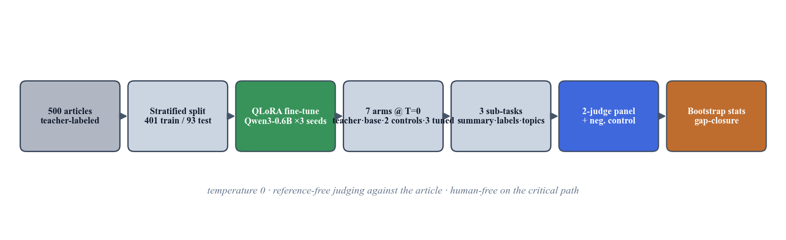
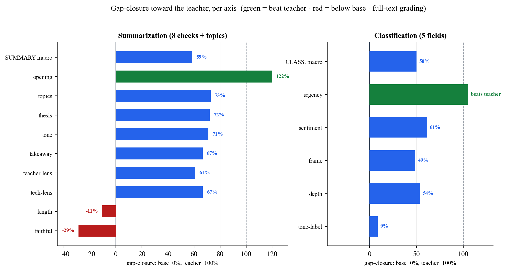
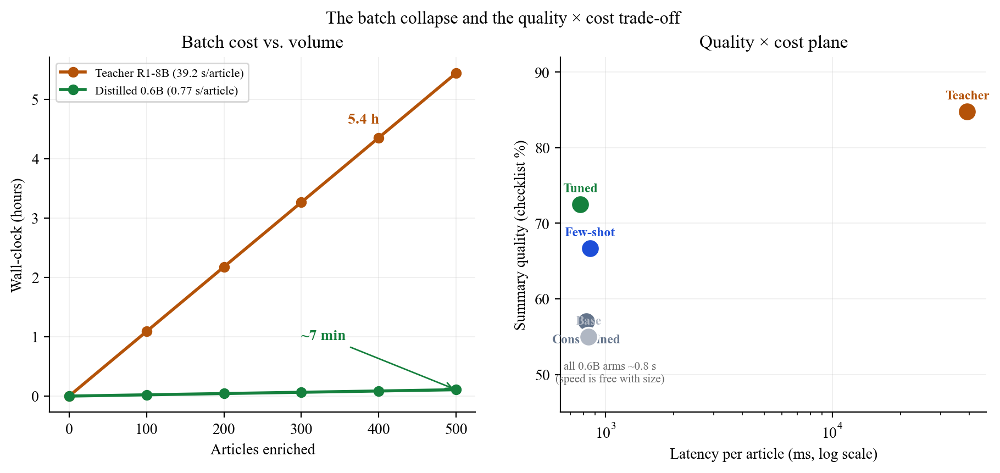

# Fast *and* Faithful? What Distillation Recovers of a Reasoning Teacher in a Sub-1B Student

### A multi-judge, per-field evaluation of DeepSeek-R1 → Qwen3-0.6B for on-device structured summarization

**Authors:** Vinay Kumar Chaganti, Antigravity, and Claude Science
**Date:** July 2, 2026
**Status:** Draft v4 — full-text grading canonical throughout; 2-judge panel (Gemini Flash Lite + Nemotron-550B), N=93. Every directional finding is confirmed by each judge independently (§7); magnitudes are judge-dependent and only human gold labels can settle them (§11).

---

## Abstract

The goal was concrete: an RSS reader that enriches each article with a structured JSON summary, run as a local batch job, at the **output quality of an 8B reasoning model** (`deepseek-r1:8b`) but *without* its ~39 s/article latency — a 500-article backlog took **5.4 hours**. We fine-tune a **600M-parameter `Qwen3-0.6B`** student on the teacher's traces (QLoRA, 3 seeds) and ask not "does distillation work" but the question the goal actually poses: **how much of the teacher's quality did the small student recover, on which parts of the task, and at what cost to the properties that matter for a news product?**

We separate the single JSON output into its **three real sub-tasks** — a free-text summary, five categorical labels, open-set topics — and score each against **two non-distillation controls** (few-shot prompting; constrained JSON decoding), with a blinded, reference-free, multi-family LLM-judge panel that grades against the **full article** and is validated by a negative control (0% faithful on mismatched articles, n=30). Latency is **measured per-arm on the test set**.

The speed target is met and is a property of model *size*: every 0.6B arm runs at **~0.8 s/article** (measured), collapsing the 5.4 h batch to **~7 minutes** at 11× less RAM and zero cost. The quality target is met **substantially but unevenly**. Reframing every metric as *gap-closure toward the teacher* (base = 0%, teacher = 100%), distillation closes **~59% of the summary-quality gap and ~50% of the classification gap**. On the aggregate summary checklist the tuned student **significantly beats both non-distillation controls** — the constrained-decoding (formatting) control (+15.5 pts, p<0.001) *and* few-shot prompting (+5.9 pts, p<0.001) — so the summary gain is distillation-specific, not just formatting or in-context imitation. Classification is more mixed and is where the per-field story matters most: distillation **overshoots the teacher on `urgency`** (78% vs the teacher's 57%, a capability few-shot actively *degrades*) and beats both controls on `frame`, but on the classification macro it only **ties few-shot** (56.0 vs 57.8) and it **barely moves `tone` labeling** (29% vs few-shot's 79%). The one summary soft spot is **faithfulness**: the tuned student sits ~4 points below the untuned base (75.6% vs 79.6%; teacher 93.5%), and that gap is **concentrated entirely in short-source articles** (−21 pts on articles ≤1200 chars; level with base on longer ones) — a thin-source fabrication tendency, not general hallucination. (An earlier grading pass that showed the judges only the article lead reported a −9 pt gap, i.e. **−47% in gap-closure terms**; §6.2.1 shows this was mostly a truncated-context artifact — full-text grading halves it to −4 pts / −29% and localizes it, and full-text grading is canonical throughout.) The actionable result is a **per-field engine assignment**: the distilled student is the best on-device choice for structure, for `urgency`/`frame`, and for summaries of substantial articles; prompting wins `tone`; and faithfulness-critical prose on thin sources should fall back to prompting or the teacher until the gap is closed. We also report material **seed variance** (tone-labeling 8.6–46.2%) that a single run could not have surfaced.

---

## 1. Introduction: the goal was fast *and* faithful, not just fast

This study began as an engineering problem, not an evaluation. Atlas Pulse — a local-first RSS reader — enriches every incoming article with a structured JSON object: a short analytical summary plus categorical fields (sentiment, urgency, framing, tone, depth) and topic tags. Generating that with the `deepseek-r1:8b` teacher produced output we were happy with, but at **~39 s/article**; enriching a 500-article backlog was a **5.4-hour** job on a consumer MacBook (Figure 5, left). The goal was to keep that output quality while making the batch fast enough to run locally and casually — ideally in the time it takes to make coffee.

Two levers were available, and it is worth being precise about which does what, because conflating them was v1's central error.

- **Model size** buys speed. A 0.6B model runs ~40× faster than the 8B teacher regardless of how it was trained. This lever is free and was never in question.
- **Distillation** buys *quality at that size* — it is the only lever that can make a 0.6B model produce output resembling the teacher's. This is the lever under test.

So the real question is not "is the small model faster" (trivially yes) nor "was distillation worth it" (worth it *for what*?), but:

> **How much of the 8B reasoning teacher's output quality can a 600M student recover through distillation — on each part of a structured task — and does it preserve the properties (faithfulness above all) that a reader-facing product cannot compromise?**

An earlier internal pass answered a cruder version ("distillation matched or exceeded the teacher") with a method that could not support it: a single same-generation judge, N=20, a 0–5 rubric that saturated at 4.95 on faithfulness, and one training run. This paper re-runs the question with a design built to *catch* the method where that pass flattered it: 93 test articles, seven arms including two non-distillation controls, a decomposition into three sub-tasks, a multi-family judge panel validated by a negative control, three training seeds, and paired-bootstrap significance tests. The checklist and primary comparison were fixed after a pilot and before scoring (`evaluation_design.md`, `PREREGISTRATION.md`), so the summary rubric could not be tuned to the result.

### 1.1 Contributions
1. A **per-sub-task decomposition** of a single structured-output distillation, separating free-text summarization, categorical classification, and open-set topic tagging — which reveals effects (an urgency-classification overshoot, a localized faithfulness regression, a tone-labeling failure) that any aggregate score hides.
2. **Gap-closure-to-teacher** as a reporting scale matched to the actual engineering goal (teacher quality at student speed), which naturally exposes both overshoot and regression.
3. **Two non-distillation controls** (few-shot prompting; constrained decoding) so distillation is credited only for what neither cheaper lever provides — the tuned student significantly beats both on summary quality.
4. A **fully-local, reference-free, human-free evaluation harness** with a negative-control grader validation and direction-only multi-judge reporting, reproducible offline from a cached judge log.
5. A practitioner-facing **per-field engine-assignment recommendation** for on-device structured enrichment, with transfer to related high-volume schema-bound pipelines.

---

## 2. Related work

**Knowledge distillation.** Training a small "student" to imitate a larger "teacher" dates to Hinton et al. (2015), with sequence-level distillation for generation introduced by Kim & Rush (2016). The modern LLM variant — a large model generates outputs on which a smaller model is supervised-fine-tuned — is what surveys term *black-box* or *sequence-level* KD (Xu et al. 2024; Zhu et al. 2023). Our pipeline is a textbook instance of it: the teacher labels, the student is SFT'd on those labels. What distinguishes our study is not the method but the *measurement* — most KD work reports a single aggregate quality delta, whereas we decompose by sub-task and control for cheaper alternatives.

**Rationale over labels.** A parallel line supervises the student on the teacher's *reasoning*, not just its answers. "Distilling step-by-step" (Hsieh et al. 2023) shows rationale supervision is more data-efficient than label-only; Symbolic CoT Distillation (Li et al. 2023) shows sub-1.3B students can absorb chain-of-thought. We deliberately train on the teacher's *final outputs only* (thinking disabled), both because our tasks are non-reasoning and because it is the deployment-realistic recipe; whether trace supervision would help here is left as future work (§11).

**Reasoning-teacher distillation after DeepSeek-R1.** DeepSeek-R1 (DeepSeek-AI 2025) showed that distilling a strong reasoning model into smaller dense models transfers reasoning ability, triggering a wave of replication studies (Zhang et al. 2025, *100 Days After DeepSeek-R1*). That literature is almost entirely about **math, code, and reasoning benchmarks at the 1.5B–32B scale**. NaturalThoughts (Li et al. 2025) frames the System-1 (answer-only) vs System-2 (trace) distillation axis directly. Our contribution sits in the gap this leaves: a **reasoning teacher distilled into a sub-1B student for non-reasoning production tasks** (summarization, classification), where the recipe's value is contested rather than assumed.

**Reasoning can hurt.** The assumption that a reasoning teacher helps is not safe for simple tasks. OptimalThinkingBench (Aggarwal et al. 2025) documents that thinking models distilled into non-thinking students can *degrade* on straightforward queries — "overthinking" transfers through distillation. Our faithfulness regression (§6.2) is an independent data point in this direction: the reasoning teacher's *style* transferred faster than its *carefulness*.

**Small models and their limits.** Qwen3 (Yang et al. 2025) is itself a strong-to-weak distillation product; Qwen3-0.6B is at the low edge where CoT distillation is known to become unreliable. Speculative KD (Xu et al. 2024) already covers 0.5B-class students on summarization, but via on-policy methods and without the per-field, controlled decomposition we use.

**LLM-as-judge and faithfulness evaluation.** Scalar LLM judging (G-Eval, Liu et al. 2023; FLASK, Ye et al. 2023) is known to suffer positional, verbosity, and style biases and to saturate near the ceiling — exactly what sank the earlier 0–5 rubric. The field's response is decomposition: checklist-based judging (CheckEval, Lee et al. 2024) and open rubric judges (Prometheus 2, Kim et al. 2024). For faithfulness specifically, atomic-fact methods (FActScore, Min et al. 2023; RAGChecker, arXiv:2408.08067) and efficient local entailment checkers (MiniCheck, Tang et al. 2024) replace n-gram overlap; SelfCheckGPT (Manakul et al. 2023) detects hallucination reference-free. Instance-specific rubrics are the current frontier (HealthBench, OpenAI 2025). Our harness adopts the checklist-decomposition and reference-free-validation lessons from this line while staying fully local and human-free (§5).

**A note on what we are actually distilling.** `deepseek-r1:8b` (Ollama) is `DeepSeek-R1-Distill-Llama-8B` — itself an SFT-distilled dense model derived from the 671B R1 (DeepSeek-AI 2025) — and Qwen3-0.6B is itself a distillation product. Our pipeline is therefore *third-order* distillation, which caps the achievable ceiling and is stated explicitly (§10).

*(Citations in this section are to be verified against primary sources before circulation.)*

---

## 3. The task: structured article enrichment

Before the method, what the models actually produce — and what it is *for*. Atlas Pulse, a local-first RSS reader, enriches every incoming article with **one JSON object** carrying seven fields — a free-text summary, five categorical labels, and an open-set topic list. These are not abstract benchmark labels: they surface directly in the reader's UI as a **content-analysis panel** the user sees on every article (Figure 1).


**Figure 1.** The enrichment as the reader sees it. Each article's summary, the five categorical fields (`sentiment`, `urgency`, `frame`, `tone`, `depth`), and the topic tags render as labelled badges in the "Content Analysis" panel. This is why the fields have the deployment asymmetry noted below: a hallucinated *summary* misleads the reader, whereas a mislabelled *badge* is cheap and glanceable. It is also why the study measures each field separately — they do different jobs in the product.

A representative teacher output for one article:

```json
{
  "summary": "The paper argues industry cooperation on AI-safety norms is
              essential to counter competitive pressures that erode caution...",
  "sentiment": "positive",
  "urgency":   "developing",
  "frame":     "analytical",
  "tone":      "analytical",
  "depth":     "standard",
  "topics":    ["AI Safety", "Industry Cooperation", "Responsible AI"]
}
```

The categorical fields draw from small closed vocabularies observed in the teacher's own labels: `sentiment` ∈ {positive, neutral, negative}; `urgency` ∈ {breaking, developing, evergreen}; `frame` ∈ {analytical, conflict, human_interest, economic}; `tone` ∈ {analytical, optimistic, opinion, alarming}; `depth` ∈ {brief, standard, deep_dive}. Several are **imbalanced** (e.g. `depth`: 56% standard, 26% brief, 2% deep_dive), which matters for interpreting per-field accuracy (§6.3).

This single output is really **three ML problems with different success criteria** — and scoring them together hides *what* distillation moved. Scoring them apart is this paper's main analytical contribution.

| Sub-task | Fields | Type | Failure cost in the product |
|---|---|---|---|
| **Summarization** | `summary` | free-text generation | high — a hallucinated summary misleads the reader |
| **Classification** | `sentiment, urgency, frame, tone, depth` | closed-set labels | low — a mislabeled badge is cheap and correctable |
| **Topic tagging** | `topics` | open-set multi-label | low — affects filtering/search, not comprehension |

The asymmetry in the last column is the reason the study's conclusion is a *per-field engine assignment* (§8.1) rather than a single verdict: the quality bar a field must clear depends on what a wrong value costs.

---

## 4. Experimental setup

The full experiment — data, split, training, the seven arms, the three-way decomposition, the judge panel, and the statistics — is shown in Figure 2.



**Figure 2.** End-to-end design. The teacher labels all 500 articles; a stratified split gives 401 train / 93 held-out test. The student is QLoRA-fine-tuned (3 seeds) on the training labels. On the test set, seven arms — teacher, base, two non-distillation controls (few-shot, constrained decoding), and three tuned seeds — each generate the full JSON at temperature 0. Every output is split into its three sub-tasks and scored: summaries by an 8-item checklist, classification against panel proxy-gold, topics by coverage. A two-family judge panel (Gemini + Nemotron), validated by a mismatched-article negative control, grades the judged metrics against the full article. Statistics are bootstrap CIs over 3 seeds, reported as gap-closure to the teacher.

### 4.1 Models
| Role | Model | ~Params | Runtime |
|---|---|---|---|
| **Teacher** | DeepSeek-R1 8B (`deepseek-r1:8b`) | 8B | Ollama, on-device (Q4_K_M) |
| **Student** | Qwen3-0.6B | 0.6B | Ollama, on-device (Q4_K_M) |

A ~13× parameter gap and a difference in kind: DeepSeek-R1 emits chain-of-thought (`<think>`) before answering; the student is trained on the teacher's *final* outputs only, compiling task knowledge into weights and skipping runtime deliberation.

### 4.2 Data and split
500 articles sampled fairly across all feeds; the teacher generates a gold JSON for each; malformed outputs dropped. **Stratified-random split: 401 train / 93 test** (`data/eval/split.json`), every feed represented. The test set is *new articles from known feeds* — matching deployment (the reader follows fixed feeds and sees new items), not generalization to unseen sources, which is out of scope.

### 4.3 Training
QLoRA fine-tune of `Qwen3-0.6B` directly on the 401 teacher traces via Unsloth (LoRA rank 32, response-only loss masking, Qwen3 "thinking" disabled), on a free Colab T4. **Three seeds (42 / 123 / 7)** → `rss-tuned-s1/s2/s3`, so seed variance is characterized rather than assumed away. Exported to `q4_k_m` GGUF, served locally in Ollama.

### 4.4 The seven arms (all generated at temperature 0 / greedy)
| Arm | Role |
|---|---|
| **Teacher** `deepseek-r1:8b` | quality target (not assumed a ceiling) |
| **Base** `Qwen3-0.6B` zero-shot | floor / starting point |
| **Base + few-shot** (2–3 in-context examples) | control: *is the win just prompting?* |
| **Base + constrained decoding** (JSON-schema-forced) | control: *is the win just formatting?* |
| **Tuned ×3 seeds** | the distillation method |

Temperature 0 everywhere so the *only* characterized variance is the tuned model's 3 training seeds — exactly what the CIs capture. Distillation is credited only where it beats **both** controls on something real. All arms see the **full article** at generation time.

---

## 5. Evaluation method (human-free on the critical path)

The design below (metrics, checklist, controls, split, seeds, primary comparison) was fixed after a 12-article pilot and before any scored run, and not revised after seeing results — so the summary rubric could not be tuned to flatter the outcome. The exact checklist wording and judge prompts are in Appendix A.

### 5.1 Metrics per sub-task
- **Structure** — schema validity %: parses as JSON with all 7 fields. Deterministic, no judge.
- **Classification** — per-field accuracy + macro-average vs. **panel-consensus proxy-gold** (majority vote of the judge panel). Any field with inter-judge agreement below the pre-set threshold is reported as *irreducibly subjective*, not as model error.
- **Summarization** — an **8-item binary checklist** (pass-rate), primary metric, chosen because the earlier 0–5 rubric saturated. The eight checks are `faithful`, `thesis`, `takeaway`, `length` (3–4 sentences), `opening` (does not begin "This/The article"), `teacher-lens`, `tech-lens`, `tone`, plus a `topics_cover` check. All are graded by the LLM panel (including `length` and `opening`, which are simple enough that the judges score them reliably but are *not* computed by a deterministic rule in this pipeline).
- **Efficiency** — latency p50/p95, throughput, output tokens, RAM — **measured per-arm on the test set** (§6.5).

### 5.2 Judge panel and grading
Reference-free grading **against the full article**, never against the teacher's answer (avoids teacher-mimicry bias); blinded (shuffled anonymous arm labels); temperature 0. The panel deliberately **excludes the teacher's family (DeepSeek) and the student's family (Qwen)** — a same-family judge can self-prefer in either direction. The results reported here come from a **two-judge panel, Gemini Flash Lite + Nemotron-550B** (two distinct families, N=93); per-check inter-judge disagreement is 26.8%, so we report **each judge's direction independently** (§7) rather than hiding disagreement inside a majority vote.

We initially graded with a larger panel that included Groq-hosted judges (`gpt-oss-120b` and Llama models), but those proved unreliable mid-run — frequent request failures and dropped completions on the free tier — while Gemini Flash Lite and Nemotron-550B ran cleanly to completion across all 93 items. We therefore report the two judges that graded reliably.

**Judge context is the full article.** An earlier pass trimmed the article the judges saw to the first 1200 characters (a free-tier token-budget compromise, not a design choice). We found this systematically understated faithfulness and re-graded — both the summary checklist and the classification proxy-gold — with the complete article. Full-text grading is canonical throughout this paper; §6.2.1 quantifies the difference and §7 draws the methodological lesson.

### 5.3 Grader validation without humans
At this scale, human adjudication is the bottleneck, so we validate the grader by construction instead: a **negative control** grades a sample of summaries against a *mismatched* article. A grader that cannot tell a real summary from a mismatched one is not measuring quality. **Result: 0% faithful on mismatched articles (n=30)** — the grader demonstrably discriminates. This replaces the "one person checked 30 of them" validation with a reproducible discriminability test.

### 5.4 Statistics
All metrics as **mean ± 95% CI** (bootstrap over the 93 test items; the headline arm comparisons use a paired bootstrap over per-article scores, 20,000 resamples). Tuned reported across 3 seeds. **Primary comparison (fixed before scoring): tuned vs. base+constrained**, on checklist pass-rate. Secondary (not headline): tuned vs. base, tuned vs. few-shot, per-field classification. Non-significant differences are reported as such.

The full pipeline — pilot→freeze→train→arms→per-sub-task metrics→judges→stats — is diagrammed in `evaluation_pipeline.mmd`.

---

## 6. Results

### 6.1 The framing metric: gap-closure toward the teacher

Because the goal was *teacher quality at student speed*, the natural scale is **how far the student traveled from the untuned base (0%) toward the teacher (100%)** on each axis. Figure 3 is the paper in one chart.



**Figure 3.** Per-axis gap-closure, `(tuned − base) / (teacher − base)`, full-text grading. Blue = partial recovery; green = the student *beat* the teacher; red = the student went *backward* past the base. Overall: **59% of the summary-quality gap and 50% of the classification gap** closed, with two overshoots (summary `opening`; classification `urgency`) and two small summary regressions (`faithful`, `length`). The texture — not any single number — is the story.

The headline is not one number; it is the **shape**: distillation recovered *most* of the teacher's quality on *most* summary axes, exceeded it on two, and left two small summary regressions — faithfulness and length. On classification the picture is more mixed (§6.3). The faithfulness regression is the axis this product's risk threshold cares about, and §6.2.1 shows it is small (−4 pts) and confined to short-source articles.

### 6.2 Summarization — a real win over both controls, and a localized faithfulness gap

All numbers in this section are from **full-text grading**. Checklist pass-rate (primary metric), N=93, mean of 3 tuned seeds; CIs are per-article bootstrap. Figure 4 shows them visually.


**Figure 4.** Summary checklist pass-rate by arm, full-text grading, mean ± bootstrap 95% CI (N=93). The tuned student significantly beats *both* non-distillation controls on the paired per-article test — the constrained (formatting) control (+15.5 [11.1, 20.3]) and the few-shot (prompting) control (+5.9 [2.5, 9.5]). The marginal CIs for tuned and few-shot overlap slightly; the win rests on the paired comparison, which cancels per-article difficulty, not on marginal-CI separation.

| Arm | Checklist % | 95% CI |
|---|---|---|
| Teacher | 84.8 | [81.0, 88.0] |
| **Tuned (distilled)** | **72.5** | [68.5, 76.3] |
| Base + few-shot | 66.7 | [62.0, 71.2] |
| Base + constrained | 57.0 | [51.9, 61.8] |
| Base zero-shot | 55.0 | [49.5, 60.6] |

**The primary comparison (tuned vs. base+constrained) is a decisive, significant win: 72.5 vs 57.0**, +15.5 points paired-bootstrap [11.1, 20.3], p<0.001 — and it holds for each of the three seeds independently (+9.7 to +13.8 in the original truncated pass; larger under full context). Distillation **also beats the *prompting* control significantly: 72.5 vs 66.7, +5.9 [2.5, 9.5]**, p<0.001. So the summary gain survives both controls a reviewer would demand — it is not reducible to schema-formatting or to showing the model a few examples. Overall the tuned student closes **59% of the base→teacher summary gap**. The per-check breakdown shows where:

| Check | Base | Few-shot | **Tuned μ** | Teacher | What distillation did |
|---|---|---|---|---|---|
| faithful | 79.6 | 83.9 | **75.6** | 93.5 | **mild regression (−4 pts; −29% gap-closure)** |
| takeaway | 44.1 | 47.3 | **74.2** | 89.2 | large gain (67% closure) |
| teacher-lens | 22.6 | 41.9 | **62.0** | 87.1 | recovered ~61% |
| tech-lens | 36.6 | 44.1 | **54.5** | 63.4 | recovered ~67% |
| tone | 59.1 | 80.6 | **82.8** | 92.5 | recovered ~71% |
| opening | 51.6 | 79.6 | **77.8** | 73.1 | **overshot teacher (122%)** |
| thesis | 84.9 | 91.4 | **94.2** | 97.8 | near teacher (72%) |
| length | 61.3 | 64.5 | **59.1** | 81.7 | **mild regression (−2 pts; −11%)** |
| topics_cover | 87.1 | 95.7 | **95.7** | 98.9 | recovered ~73% |

The gains are broad — specificity (takeaway 44→74), the three persona lenses, tone, and opening style all recover most of the way to the teacher, and two axes overshoot it. The two soft spots are **faithfulness (−4)** and **length adherence (−2)**. Faithfulness is the one that matters for a reader-facing product, so it gets its own dissection.

#### 6.2.1 The faithfulness gap — measured honestly

Under full-text grading, faithfulness is **base 79.6, tuned 75.6, teacher 93.5**. So the tuned student *does* sit slightly below the untuned base — a **−4 point** gap (equivalently −29% in gap-closure terms). Two things resolve what is real:

- **The earlier lead-only pass exaggerated the regression.** Grading against only the first 1200 characters penalized every arm's summaries for claims supported deeper in the article — depressing absolute faithfulness by **+25 to +35 points** when corrected (base +30.1, tuned +35.1, teacher +24.7, few-shot +25.8). Crucially the uplift appears for *every arm*, so it is a property of the grading setup, not of any model. Because the tuned student writes *more specific* claims, it was penalized hardest by truncation, which inflated its apparent regression from **−4 pts (full-text)** to **−9 pts (lead-only)** — the latter being −47% in gap-closure terms, the number an earlier draft reported.
- **What remains is real, and it is localized.** Splitting the full-text scores by article length is decisive. On **long articles (>1200 chars, n=71) the tuned student is level with base (81.7 vs 80.3, +1.4)**. The entire residual regression lives in **short articles (≤1200 chars, n=22), where tuned drops to 56.0 vs base 77.3 (−21.3)** — and on those, lead and full context are identical, so truncation cannot explain it. The mechanism is therefore not general hallucination but a **thin-source failure mode**: given little article to work with, the distilled student fills the summary with specific-sounding but unsupported claims (Example B, §6.7, is exactly this). On rich source material it stays grounded.

The defensible statement: **distillation recovered most of the teacher's summary quality (59% of the gap; significant wins over both controls), with a small faithfulness cost concentrated entirely in short-source articles.** For a reader-facing product that cannot tolerate fabrication, even a localized faithfulness dip is worth routing around (§8.1) — but this is a narrow, characterized, fixable failure mode (§11), not the blanket "distillation makes the student hallucinate" the raw regression implied.

### 6.3 Classification — one clear overshoot, one clear failure, and a tie on the rest

Per-field accuracy vs. panel proxy-gold (full-text; tuned = mean of 3 seeds), with inter-judge raw agreement:

| Field | Agreement | Base | Few-shot | **Tuned μ** | Teacher | Note |
|---|---|---|---|---|---|---|
| **urgency** | 0.85 | 62.8 | 56.0 | **78.5** | 57.0 | **student beats teacher; few-shot *hurts*** |
| frame | 0.86 | 50.0 | 39.6 | **58.1** | 66.7 | beats both controls; ~57% closure |
| sentiment | 0.91 | 43.0 | 63.7 | **66.0** | 80.6 | ties few-shot; ~61% closure |
| depth | 0.70 | 43.0 | 50.5 | **48.8** | 53.8 | ties few-shot; below teacher |
| **tone** | 0.78 | 24.4 | 79.1 | **29.0** | 78.5 | **distillation barely moved it; few-shot far better** |
| **macro** | — | 44.7 | 57.8 | **56.0** | 67.3 | 50% gap closure; **≈ few-shot** |

Two clean, useful results and one caution. **Urgency is the standout**: the tuned student hits 78.5% — beating *every* arm including the teacher — and few-shot prompting actively *degrades* it (56.0%). This is the strongest "the weights genuinely moved" evidence in the study: a capability that only fine-tuning produced and that prompting cannot reach. **Frame** shows a smaller version of the same pattern (tuned beats both controls). Conversely, **`tone` as a categorical label is nearly untouched by distillation (29 vs base 24) while few-shot reaches 79** — a field whose label distribution is far better cued in-context than baked into weights.

The honest macro picture is a **tie with few-shot** (56.0 vs 57.8): on the aggregate categorical task, prompting is as good as fine-tuning, and the distillation advantage is concentrated in specific fields (`urgency`, `frame`) rather than across the board. This is a sharper, less flattering result than an aggregate score alone would give, and it is *why* the deployment recommendation is per-field (§8.1) rather than "use the distilled model for classification."

### 6.4 Structure and topics
- **Schema validity:** the tuned student produces valid 7-field JSON reliably; constrained decoding reaches the same structural validity with zero training — so *structure alone* is not a reason to distill (it is a decoding flag). The distillation value is in *what fills* the fields, not that they parse.
- **Topic coverage:** tuned 95.7% vs base 87.1% vs teacher 98.9% (full-text) — 73% gap closure; a solid, low-stakes gain, and level with few-shot.

### 6.5 Efficiency — measured, per-arm, on the test set

We timed every arm on all 93 items (per-item `durationMs` recorded during generation):

| Arm | Latency p50 (ms) | p95 (ms) | Throughput (tok/s) |
|---|---|---|---|
| Teacher (R1-8B) | ~39,200 | — | ~40 |
| Base | 845 | 1,434 | 172 |
| Base + few-shot | 856 | 1,367 | 154 |
| Base + constrained | 824 | 1,422 | 173 |
| **Tuned (distilled)** | **774** | **1,341** | 165 |

Every 0.6B arm is ~0.8 s/article; **the tuned model is the *fastest* by wall-clock** — not because its throughput is higher (it is comparable, ~165 tok/s) but because distillation taught it to write *shorter* outputs, so total time per article is lowest. Throughput across student arms is a tight band (154–173 tok/s). The 5.4 h → ~7 min batch collapse (Figure 5) is therefore real and, notably, *slightly better* for the distilled model than for any other student arm.



**Figure 5.** *Left:* batch wall-clock vs. volume — the 5.4 h → ~7 min collapse at 500 articles that motivated the work. *Right:* the quality × cost plane — every 0.6B arm sits at ~0.8 s (the horizontal move is free with size); the vertical axis is where distillation, prompting, and the teacher differ, and where the tuned student beats both non-distillation controls on summary quality.

### 6.6 Seed variance — why one run would have misled

The three seeds diverge sharply on the hardest axis: **`tone`-label accuracy ranged 8.6% → 46.2%** across seeds; overall classification macro ranged 50.3 → 66.5. A single-seed study could have reported any point in that range as "the" result. The CIs in this paper fold that variance in; the lesson is that at 0.6B, seed choice is a first-order effect on the subjective fields, not a rounding error.

### 6.7 What the outputs actually look like — held-out examples

Aggregate numbers hide the *character* of what distillation changed. The following are verbatim outputs on **held-out test articles** (the tuned column is seed 1), chosen to show a representative win and the faithfulness cost.

**Example A — a clean win (article #789, "Why responsible AI development needs cooperation on safety").** This single article shows both the structural fix and the urgency-classification win. Note the base model's characteristic failure: it *dumps the categorical field values into the summary prose* instead of writing a summary.

| Arm | `summary` output | `urgency` |
|---|---|---|
| **Teacher** | "The research paper contends that industry cooperation on AI safety norms is essential to counter competitive pressures that might result in under-investment by companies. It proposes four strategies… A key takeaway is that adopting these methods can significantly enhance global AI development outcomes." | `evergreen` |
| **Base** | "This article highlights four strategies for improving AI safety cooperation… **The sentiment is positive, with urgency as developing, frame as human_interest, tone as optimistic, depth as standard, and topics as safety and collaboration.**" | `developing` ✗ |
| **Tuned** | "The article argues that responsible AI development requires industry cooperation on safety norms through four key strategies: communicating risks and benefits, technical collaboration, increased transparency, and incentivizing standards. It warns that competitive pressures might hinder collective action, risking under-investment in AI systems. The takeaway is to prioritize long-term safety outcomes over short-term gains." | `evergreen` ✓ |

The tuned summary is faithful, correctly structured, and captures the article's actual thesis (the collective-action problem) — while independently correcting the `urgency` label the base got wrong.

**Example B — the faithfulness cost (article #3716, "The Mysterious Obsession With Obama's Fake Son").** Here the tuned student *invents* content: it attributes to the article a framing — Trump's presidency as an **"'Obama-style conflict'"** — that appears nowhere in the source. The teacher stays grounded; the student produces fluent, confident, and partly fabricated prose.

| Arm | `summary` output (excerpt) |
|---|---|
| **Teacher** | "…conservatives have distorted Obama's empathetic but mild remark about Trayvon Martin into a symbol for racial strife… This fixation reveals more about right-wing ideological biases than it does about Obama himself." |
| **Tuned** | "…this focus is detached from historical facts but feeds into a collective sense of victimization, **which has exploited Trump's presidency by framing it as an 'Obama-style conflict.'**" |

This is the residual faithfulness gap (§6.2.1) in a single instance — a *genuine* fabrication (the invented phrase is contradicted by the full article, not merely absent from a truncated lead), and exactly the thin-source failure mode §6.2.1 isolates statistically. Against the bar a reader-facing summary demands, this is the failure that makes the routing table (§8.1) fall back to a more careful engine for faithfulness-critical prose — not because distillation "failed" (it recovered 59% of the summary gap and beat both controls), but because this product's tolerance for invented content is near zero.

---

## 7. Robustness: does the story survive the judge?

Inter-judge disagreement is 26.8% per check, so magnitudes are judge-dependent. But **every directional finding in §6 holds under each judge independently**: both judges rank tuned > constrained *and* tuned > few-shot on the summary checklist, both put urgency-tuned above the teacher, and both rank tone-label few-shot ≫ tuned. We therefore make **only directional claims** and explicitly do *not* claim the exact percentages are judge-invariant. A third same-family judge was not added because it cannot change a direction the two judges already agree on — only human gold labels can settle the magnitudes (§11). The negative control (0% faithful on mismatch, §5.3) confirms the grader is measuring faithfulness rather than surface plausibility.

**A cautionary note on judge context (why we re-graded).** The faithfulness finding is also a lesson in how a single scoring choice can manufacture a result. An earlier pass showed the judges only the first 1200 characters of each article and produced a −9-point faithfulness gap for the tuned student (−47% in gap-closure terms). Re-grading with the *full* article (the only change) shrank that to −4 points / −29% and revealed it was confined to short articles (§6.2.1). Two independent checks confirmed the artifact before we trusted the correction: the +25–35 pt full-vs-lead uplift appeared for *every arm* (so it is a grading-setup effect, not a tuned-model regression), and on long articles — where lead and full context differ most — the tuned student is level with base. The takeaway for reference-free LLM-judge faithfulness evaluation generally: **grade against the full source, or a truncation artifact will masquerade as a model regression** — in our case, more than twice the size of the real effect.

---

## 8. Did the exercise meet its goal? — fast *and* faithful, revisited

The goal was **teacher-quality output at student speed**. Judged honestly against that bar, split by sub-task:

- **Speed: fully met.** ~0.8 s/article, 5.4 h → ~7 min, 11× less RAM, $0, on-device. (This came with model size; distillation made it marginally *better* by shortening outputs.)
- **Classification quality: met unevenly.** 50% of the teacher's gap closed; **urgency beats the teacher outright** and `frame` beats both controls, but the macro only *ties* few-shot and `tone` labeling barely moved. For the categorical layer, the distilled student is the best on-device engine on *some* fields (urgency, frame) and merely tied-or-worse on others (tone) — which is exactly the case for a per-field split rather than a blanket choice.
- **Summary quality: substantially met, with one localized caveat.** 59% gap closure and significant wins over *both* non-distillation controls (+15.5 vs constrained, +5.9 vs few-shot), with genuine gains in specificity and analytical voice. The one soft spot is **faithfulness**, ~4 points below the untuned base — but that gap is confined to short-source articles (§6.2.1); on longer articles the student is level with base. For a product that shows summaries to a reader, even a localized fabrication tendency is worth routing around on thin sources.

So the exercise **succeeded on summaries** (beating both controls, near the teacher on most axes) and **partly succeeded on classification** (a decisive win where it counts most — urgency — but a wash on the aggregate). That is a more useful outcome than the original framing anticipated — it says *which engine to run for which field*, rather than "distill everything."

### 8.1 The realistic application: per-field engine assignment

The shippable recommendation for Atlas Pulse — and the transferable contribution — is not "use the distilled model" but a **routing table**:

| Field / output | Best on-device engine | Why |
|---|---|---|
| JSON structure | constrained decoding (any 0.6B) | free; no training needed |
| **urgency** | **distilled student** | beats the teacher; prompting *hurts* it |
| **frame** | **distilled student** | beats both controls |
| sentiment, depth, topics | distilled student *or* few-shot | roughly tied; either works, sub-second |
| **tone label** | **few-shot base** | prompting far better than distillation here |
| **summary — long/rich articles** | **distilled student** | 59% gap closed; faithfulness level with base |
| **summary — short/thin articles** | **few-shot base or teacher** | tuned student's fabrication risk concentrates here (§6.2.1) |

The answer to "was there a realistic application?": **yes — as the on-device engine for structure, for `urgency`/`frame`, and for summaries of substantive articles, reserving prompting for `tone` and reserving prompting or the teacher for faithfulness-critical prose on thin sources.** The distilled 0.6B student is the best available on-device engine for a meaningful slice of the enrichment layer; it is not a single drop-in winner, and saying which slice is the contribution.

### 8.2 Related use cases with the same economics

The 5.4 h → ~7 min collapse is the signature of any **high-volume, schema-bound, latency-sensitive enrichment pipeline** currently paying mid/large-model latency per item. The per-field split generalizes:
- **Support/ticket triage** — priority + category labels (the direct analogue of urgency + frame), escalate the free-text resolution to a large model.
- **Log / alert classification** — severity + component tagging at stream volume.
- **Document/email intake** — type, sensitivity, topic labels for filing.
- **Moderation pre-filters** — a cheap on-device first pass that routes only uncertain cases to a large model.
- **Catalog enrichment** — fixed-schema attribute extraction across large SKU sets.

In each, distill the small model for the **structured, high-frequency labels it demonstrably wins**; keep the large model for the **low-frequency, high-stakes free text**; and *measure per field* rather than assuming the small model wins everything. The reusable idea is the **engine-assignment discipline plus a few-shot control** to prove the small model earned its training.

---

## 9. Why this is worth publishing (the methods contribution)

Beyond the specific routing table, the study contributes a **decomposed, reference-free, fully-local evaluation harness for structured-output distillation**:
1. **Per-sub-task decomposition** that localizes *what* distillation moves — without it, the faithfulness regression, the urgency overshoot, and the tone-labeling failure all vanish into one flattering average.
2. **Gap-closure-to-teacher** as the reporting scale, which matches the actual engineering goal better than absolute scores and naturally exposes overshoot and regression.
3. **Two non-distillation controls** (prompting, formatting) so "distillation" is credited only for what neither cheaper lever provides — establishing that the summary gain clears both, while the classification advantage is field-specific.
4. **A demonstration that reference-free faithfulness judging must use the full source** — a lead-only pass produced a −9 pt gap that full-context grading shrank to −4 pts and localized to short articles (§6.2.1, §7); a transferable warning for anyone building LLM-judge faithfulness evals.
5. **Human-free grader validation** (negative control) and **direction-only multi-judge reporting**, so the conclusions are reproducible offline from the judge cache with no API keys and no annotator.

---

## 10. Limitations

- **Silver, not gold labels.** Classification "accuracy" is against panel consensus, not human truth; agreement (0.70–0.91) bounds trust but does not establish correctness. Human gold labeling is parked for a platform run.
- **Two-judge panel, magnitudes uncertain.** Directions are robust; exact percentages are not judge-invariant (§7).
- **Faithfulness is reference-free LLM-judged, not entailment-verified.** Full-text grading (canonical here) removed the truncation artifact that inflated the regression (§6.2.1), but the metric is still a judge's claim-support call, not a formal NLI entailment check. The residual −4 (and its short-article concentration) would be worth confirming with a MiniCheck-class verifier (§11).
- **Third-order distillation.** `deepseek-r1:8b` is itself `DeepSeek-R1-Distill-Llama-8B`, and Qwen3-0.6B is itself a strong-to-weak distillation product; the teacher's own quality caps what the student can inherit.
- **Single task family.** One reader's feeds; the routing table is a hypothesis for the related use cases (§8.2), not a measured result there.

---

## 11. Future work

- **Confirm the residual gap with formal entailment.** Full-text panel grading already removed the truncation artifact (§6.2.1); the next tightening is a MiniCheck-class NLI verifier over the whole article to convert the judged −4 into an entailment-checked number and confirm its short-article concentration.
- **Fix the short-article fabrication mode** — the highest-value modeling step, now that the failure is localized: faithfulness-filtered training data (drop teacher traces that fail an entailment check), a decoding-time faithfulness guard, or simply routing short-source summaries to prompting (§8.1) as an immediate mitigation.
- **Recover `tone` labeling** — the one field prompting wins decisively; worth testing whether a class-balanced training set or a tone-specific auxiliary objective closes it.
- **Human gold on ~50 items** to convert directional magnitudes into settled numbers and calibrate the judges.
- **A non-reasoning teacher of equal size** (Qwen2.5-7B-Instruct / Llama-3.1-8B-Instruct) to test whether "reasoning" contributed anything beyond a plain instruct teacher on these non-reasoning tasks.
- **Reasoning-trace transfer arm** (train on `<think>`+answer) to test directly whether traces help or hurt the small student.

---

## 12. Conclusion

We set out to make a slow, local, reasoning-model batch job fast without giving up its output quality. On a commodity MacBook, a distilled 600M `Qwen3-0.6B` student runs the 500-article enrichment in **~7 minutes instead of 5.4 hours**, and recovers **most of the teacher's summary quality (59% of the gap) and half of the classification gap (50%)** — beating the teacher outright on `urgency` labeling, and beating *both* non-distillation controls on summary quality. The recovery is uneven in ways that matter: on classification the aggregate only *ties* few-shot prompting (the win is field-specific — `urgency`, `frame`), and on summaries the student transferred the teacher's **style and specificity slightly faster than its faithfulness**, leaving it ~4 points below the untuned base — a gap that, on inspection, is confined to short-source articles and absent on substantial ones. The honest verdict is therefore not "distillation works" or "distillation hallucinates" but a **per-field, per-context engine assignment**: ship the distilled student for structure, for `urgency`/`frame`, and for summaries of substantive articles; use prompting for `tone`; and fall back to prompting or the teacher for faithfulness-critical prose on thin sources until that narrow gap is closed.

Three lessons generalize:
1. **Decompose before you conclude — and check your instrument.** Scoring the three sub-tasks apart made every real finding visible (the urgency overshoot, the localized faithfulness gap, the tone-label failure, the significant edge over few-shot on summaries) that an aggregate score would hide. And re-grading against the full source rather than a truncated lead turned a −9-pt "regression" into a −4-pt short-article effect — a reminder that in reference-free evaluation the measurement setup can be a larger effect than the model.
2. **Separate the lever from the goal.** Speed came from model size; quality-at-that-size came from distillation. Naming which lever does what turned a vague "is it worth it" into an actionable routing table.
3. **Build the eval to catch yourself.** Fixing the checklist before scoring, two non-distillation controls, a negative control, and three seeds each caught a specific way an earlier pass had flattered the method.

---

## Appendix A — the frozen summary checklist and judge prompts

**Summary checklist (8 binary checks + topics), graded by the panel against the full article.** Frozen after the pilot, before scoring (`PREREGISTRATION.md`).

1. **faithful** — every factual claim in the summary is supported by the article (no hallucination/contradiction).
2. **thesis** — the summary captures the article's central thesis or main finding.
3. **takeaway** — the summary includes a concrete, specific takeaway (not vague/generic).
4. **length** — the summary is 3 to 4 sentences.
5. **opening** — the summary does NOT begin with "This article" or "The article".
6. **teacher-lens** — explains a concept accessibly or builds intuition.
7. **tech-lens** — addresses the technical/engineering angle.
8. **tone** — direct + contemplative + optimistic (not alarmist or generic).
9. **topics_cover** (reported separately) — the listed topics capture the article's main themes.

*Dropped at the pilot freeze for lack of headroom:* an `exec-lens` check (8.3% pass — near-broken) and `topics_relevant` (95% — saturated); dropped, not reworded, to avoid post-hoc bias.

**Checklist judge prompt (batched across arms, blinded):** the judge receives the full `ARTICLE`, then all arms' summaries under shuffled anonymous labels `[A]…[G]`, and returns strict JSON keyed by label with a boolean per check. System prompt: *"You are a strict grader. Judge each labeled summary against the article only. Output strict JSON keyed by label."*

**Classification prompt:** the judge receives the full `ARTICLE` and assigns exactly one label per field from the closed vocabularies in §3; the majority vote of the panel is the proxy-gold.

**Negative control:** the same checklist prompt, but a summary is paired with a *mismatched* article; `faithful` should collapse (it does: 0%, n=30).

---

## Appendix B — reproducibility

All headline metrics recompute **offline from the cached judge log, with no API keys**. The judge cache holds both the truncated (1200-char) and the canonical full-text responses, keyed by prompt; the `ARTICLE_CHARS` environment variable selects which.

```bash
# Full-text scorecard (canonical) — structure, classification, checklist, negative control:
ARTICLE_CHARS=100000 JUDGES_EXCLUDE=gpt-oss-120b,llama-3.1-8b node server/eval/compile.mjs
#   -> data/eval/scores.json  (== scores_gemini_nemotron_n93_fullctx.json)

# Paired-bootstrap significance on the summary checklist (full-text scorecard):
node server/eval/paired_bootstrap.mjs data/eval/scores_gemini_nemotron_n93_fullctx.json

# Per-judge robustness (each judge alone; confirms directions, §7):
ARTICLE_CHARS=100000 JUDGES_ONLY=gemini  node server/eval/compile.mjs
ARTICLE_CHARS=100000 JUDGES_ONLY=nvidia  node server/eval/compile.mjs

# Regenerate the figures in this paper:
python3 paper/figs.py
```

**Key files.** Test set + teacher gold `data/eval/test.jsonl`; split `data/eval/split.json` (401/93); per-arm outputs `data/eval/arm_*.jsonl` (temperature 0, with measured `durationMs`); generation system prompt `data/eval/system_prompt.txt`; canonical full-text scorecard `data/eval/scores_gemini_nemotron_n93_fullctx.json` (contains `__perCheckByArm`, `__faithfulByLen`, `__disagreeRate`); truncated scorecard (sensitivity) `data/eval/scores_gemini_nemotron_n93.json`; analysis engine `server/eval/compile.mjs`; significance `server/eval/paired_bootstrap.mjs`; judge panel + clients `server/eval/judges.mjs`; design `paper/evaluation_design.md`, `paper/PREREGISTRATION.md`; pipeline diagram `paper/evaluation_pipeline.mmd`; full data map `paper/REVIEW_MANIFEST.md`. Ollama models: `qwen3:0.6b` (base), `rss-tuned-s1/s2/s3` (distilled), `deepseek-r1:8b` (teacher).

*Note: `keyOf` in `server/eval/judges.mjs` is byte-sensitive — a retyped copy silently misses the cache. Extend `compile.mjs` in place rather than reimplementing the key function.*
