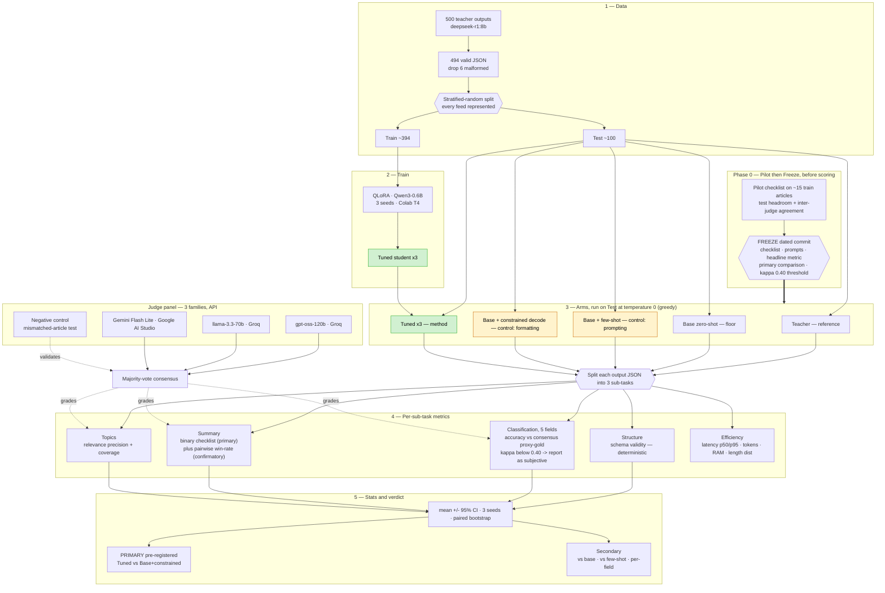

# Evaluation Design — 500-Article Distillation Study

**Status:** v0.8 — added pipeline diagram (§1.5). **All decisions resolved, frozen-ready** (v0.7: stratified-random split locked; pre-registered κ<0.40 threshold for subjective fields — report separately, never widen definitions). (v0.6: locked the 3-family judge panel — gpt-oss-120b + llama-3.3-70b (Groq) + Gemini Flash Lite (Google AI Studio). v0.5: named the pre-registered primary comparison — tuned vs. base+constrained — in §7 + §5.6 freeze, controlling multiple comparisons. v0.4: few-shot arm fully threaded into §7 significance + §8 results matrix. v0.3: negative-control grader validation, few-shot base arm, pre-registration freeze, temp-0 eval, constrained control in pairwise; fixed stale human-check reference) · Companion to `distillation_working_paper.md`
**Scope:** Local proof-of-concept. Heavy/exhaustive variants are explicitly parked for the RapidCanvas Platform (see §9).

---

## 1. Goal
Quantify, honestly and with statistics, what distilling `deepseek-r1:8b` into `Qwen3-0.6B` actually buys — **decomposed by the three sub-tasks the JSON output really contains**, and tested against non-distillation baselines so the win isn't just "formatting."

Two gains, unchanged from the paper:
- **Quality gain at constant cost** — tuned vs. untuned `Qwen3-0.6B` (same size → same latency).
- **Cost/latency gain at matched quality** — student vs. the 8B teacher.

---

## 1.5 Pipeline at a glance

*Yellow = the two non-distillation controls; green = the distilled method. Dotted lines = the judge panel grading / validating. The Phase-0 freeze gates the scored run.*

---

## 2. The task is three sub-tasks
The single JSON output bundles three different ML problems, which we score **separately**:

| Sub-task | Fields | Type | Nature |
|---|---|---|---|
| **Summarization** | `summary` | free-text generation | subjective quality |
| **Classification** | `sentiment, urgency, frame, tone, depth` | closed-set labels | subjective labels, no free gold |
| **Topic tagging** | `topics` | open-set multi-label | fuzzy, open vocabulary |

Reporting them apart is the study's main analytical contribution: *where does reasoning-teacher distillation help a sub-1B student — structure, classification, summarization, or none?*

---

## 3. Test set
- **Size:** ~100 held-out articles (up from 20).
- **Split (DECIDED): stratified-random holdout** — random articles held out from *every* feed. Matches the actual deployment (the reader follows fixed feeds and sees *new articles* from them). Feed-holdout (entire feeds withheld — harder generalization to unseen sources) is retained only as an optional secondary stress test.
- Remaining ~400 articles → training set. All from the fair stratified 500-sample (`sample_500.json`), so every feed is represented.

---

## 4. Arms
| Arm | Purpose |
|---|---|
| **Teacher** `deepseek-r1:8b` | reference point (not a "ceiling" — v1 showed the base already ~matched it) |
| **Base** `Qwen3-0.6B` zero-shot | floor |
| **Base + few-shot** (2–3 in-context examples, no training) | cheapest non-distillation baseline — if ≈ tuned, prompting matched fine-tuning; if tuned wins, cleanest evidence the *weights* moved |
| **Base + constrained decoding** (Ollama `format`=JSON schema) | **isolates the "85→100% JSON" win** — is it distillation or just formatting? |
| **Tuned** `Qwen3-0.6B` ×3 seeds | our method (3 seeds for variance) |

The two key controls: **constrained decoding** (is the win just formatting?) and **few-shot** (is the win just prompting, without moving weights?). Distillation is only interesting if it beats *both* on something real.

---

## 5. Metrics per sub-task

### 5.1 Structure (objective, deterministic — no judge)
- **Schema validity %**: parses as JSON with all 7 fields. Free, exact.

### 5.2 Classification (5 categorical fields)
- **Metric:** per-field accuracy + macro-average, against **panel-consensus proxy-gold**.
- **Proxy-gold:** the judge panel (§6) labels each field; **majority vote = proxy truth**. Less circular than teacher-as-truth.
- **Fully automated — no human-in-the-loop locally.** The proxy-gold's reliability is reported as **inter-judge agreement (Fleiss' κ) per field**, and we state the limitation honestly: *agreement means the judges concur, not that they are correct.* We do **not** run a human spot-check in the local PoC — human adjudication to validate the panel is parked for the platform (§9). Better to be transparent that this is panel-based than to bless it with a token 20-item human check.
- **Subjective fields — pre-registered κ threshold (0.40).** `tone`/`frame` are genuinely ambiguous. Any field whose inter-judge **κ < 0.40** (threshold frozen in §5.6) is **reported separately as irreducibly subjective at 0.6B** — which is itself a legitimate result. We do **not** widen the label definitions to force agreement: that is exactly the post-hoc rubric-editing the freeze exists to prevent.
- **Grader validation via negative control (no human, closes the correctness gap).** κ shows judges *agree*, not that they're *right* — five judges can agree and all be wrong. So we run a **negative control**: grade a sample of summaries against a **mismatched article**, and confirm the panel scores them **far lower** (faithfulness/thesis checks should collapse toward 0). A grader that can't separate a real summary from a mismatched one isn't measuring quality. Passing this converts "transparently unvalidated" into "demonstrably discriminates good from bad" — ~15 lines, applies to the summary checklist and the topic-relevance checks alike.

### 5.3 Summarization — **binary checklist (primary) + pairwise win-rate (confirmatory)**
Chosen over a 0–5 rubric because that saturated last time (faithfulness 4.95, no headroom). Binary checks are absolute, diagnostic, and per-item (clean CIs); pairwise cross-checks the holistic verdict.

**Binary checklist — FROZEN 2026-07-02 (8 checks). Source of truth: `PREREGISTRATION.md`.**
| # | Check | Grader |
|---|---|---|
| 1 | Every factual claim is supported by the article (no hallucination/contradiction) | judge |
| 2 | Captures the article's central thesis/finding | judge |
| 3 | Includes a concrete, specific takeaway (not vague) | judge |
| 4 | Length is 3–4 sentences | deterministic |
| 5 | Does not open with "This article"/"The article" | deterministic |
| 6 | **Teacher lens** — explains a concept accessibly / builds intuition | judge |
| 7 | **Technologist lens** — addresses the technical/engineering angle | judge |
| 8 | **Tone** — direct + contemplative + optimistic (not alarmist/generic) | judge |
*Dropped at the pilot freeze (no headroom):* `Executive lens` (8.3% pass — near-broken) and `topics_relevant` (95% — saturated). Dropped, not reworded, to avoid post-hoc wording bias. The teacher/tech/tone persona checks retain good headroom (35–80% in the pilot).

**Pairwise win-rate (confirmatory):** for each article, panel picks the better summary — **tuned vs. base**, **tuned vs. base+constrained** (the key control — where near-ceiling differences actually resolve), and **tuned vs. teacher** — on overall usefulness+faithfulness. Report win-rate. Order of A/B randomized and run **both orders** to cancel position bias; judges blind to which arm is which.

### 5.4 Topic tagging (open-set)
Exact-match F1 is too harsh (valid tags, different words). Judge-based, and **frozen to coverage only**:
- **Coverage** (`topics_cover`): do the listed topics capture the article's main themes?
- ~~Precision / relevance~~ — dropped at freeze; `topics_relevant` saturated at 95% (every arm's topics were judged relevant), so it carried no signal.

### 5.5 Efficiency (per arm, in Ollama)
**Eval-time temperature = 0 (greedy) for every arm**, so each arm is a single deterministic pass and the *only* characterized variance is the tuned model's 3 training seeds — which is exactly what the CI (§7) is meant to capture. (Sampling at temp>0 would make base/constrained/teacher single stochastic draws while only tuned had its variance characterized — an asymmetry. The teacher's intrinsic `<think>` is unaffected by this.)

Latency **p50/p95**, throughput (tok/s), avg output tokens, peak RAM. Teacher latency reported with the caveat that `deepseek-r1` reasons regardless of `think:false`, so we also give its throughput (fairer than wall-clock) — the speedup shouldn't be inflated by the very reasoning we distilled away.

### 5.6 Pilot the checklist first (do this before the full run)
The checklist is only as good as its items, so we **pilot it on ~10–15 articles across all arms before the full eval** and inspect:
- **Headroom** — the per-check pass-rate distribution. Any check that everything passes (saturated) or everything fails (broken) is reworded or dropped. A useful check must *discriminate*.
- **Judge agreement** — inter-judge κ per check. Checks the judges can't agree on are ambiguous → reword or cut.
- **Wording** — spot-read disagreements to tighten definitions (esp. the persona-lens checks 6–8).
Only the piloted, revised checklist is used for the scored run. The pilot articles are drawn from the *training* split so they don't contaminate the test set.

**Pre-registration freeze.** After piloting, we **commit (dated) the frozen checklist, judge prompts, the headline metric, the primary comparison (tuned vs. base+constrained, §7), and the classification κ threshold (0.40, §5.2) *before* running the scored eval** — and do not revise them after seeing scores. (v1's rubric was revised post-hoc, which is exactly the credibility gap this closes; it costs nothing.)

### 5.7 Confound monitoring: output-length distribution per arm
Length is a known confound — judges and pairwise preference can favor longer (or shorter) outputs, and length drives latency. So we **report the output-length distribution (tokens + sentences) per arm** and:
- Check whether checklist pass-rate / win-rate **correlates with length** (if it does, we flag length as a driver, not quality).
- Watch for an arm gaming metrics by verbosity or terseness (e.g. a tuned model that learned to pad).
- Cross-reference the "3–4 sentences" structural check (5.3 #4).

---

## 6. Judge panel
Reference-free grading against the **article**, never the teacher's answer (avoids teacher-mimicry bias).

- **Panel — 3 judges, 3 families, all API (no local judges):**
  - `openai/gpt-oss-120b` — OpenAI / GPT-OSS family, via **Groq**
  - `llama-3.3-70b-versatile` — Meta Llama family, via **Groq**
  - Gemini Flash Lite — Google family, via **Google AI Studio**
  Three distinct lineages → real cross-family robustness; odd count → clean majority vote. Keys via `.env` (`GROQ_API_KEY`, `GOOGLE_API_KEY`).
- **Excluded — both the teacher's and the student's families:** `deepseek-r1` (the teacher) **and** `qwen` (the student `Qwen3-0.6B`'s family). A same-family judge self-prefers — biasing toward the student exactly as a teacher-family judge would bias toward the teacher. The panel above is deliberately neither lineage.
- **Caveat:** Gemini Flash Lite is the lightest of the three; the pilot's per-check κ and the negative control (§5.2) will confirm it's a reliable vote — if it's noisy, swap for a stronger Gemini.
- **Ops:** batch all checklist items into one call per (item, arm); rate-limit-aware + resumable (backoff + checkpointing) so free-tier caps only slow the run, never lose work.
- **Consensus:** majority vote (classification labels, binary checks); averaged win-rate (pairwise).
- **Controls:** judge temperature 0; blind to arm identity; A/B order randomized + both-orders for pairwise.
- **Reported:** inter-judge agreement (Fleiss' κ) per criterion, plus the **negative-control** result (§5.2), so the panel's reliability is auditable. (No human spot-check — see §5.2.)

---

## 7. Statistics
- All metrics as **mean ± 95% CI** (bootstrap over the ~100 test items).
- Tuned model reported across **3 seeds** (mean + spread; seed variance folded into the CI).
- **Significance:** paired bootstrap on per-item scores for the headline comparisons — tuned vs. base, tuned vs. **base+few-shot**, and tuned vs. **base+constrained** (both controls tested, matching §4's claim that distillation must beat *both*). Report the effect size and CI of each difference, not just a p-value.
- **Primary pre-registered comparison: tuned vs. base+constrained** (does distillation beat the free formatting fix?). All others — vs. base, vs. few-shot, and the per-field classification tests — are **secondary**. Naming one primary controls the multiple-comparisons problem: it's frozen in §5.6 *before* scoring, so the headline can't be cherry-picked after seeing which comparison looked best.
- If a difference (e.g. 91 vs 88.5) is **not** significant, we say so — that is a valid result.

---

## 8. What "done" looks like — the results matrix
For each arm, per sub-task:

| Arm | Schema % | Class. acc (macro) | Summary checklist % | Summary win-rate vs base | Topics prec / coverage | Latency p50/p95 | RAM |
|---|---|---|---|---|---|---|---|
| Teacher | | | | — | | | |
| Base zero-shot | | | | (ref) | | | |
| Base + few-shot | | | | | | | |
| Base + constrained | | | | | | | |
| Tuned (3-seed mean±CI) | | | | | | | |

---

## 9. Parked for the RapidCanvas Platform (not local)
- Second, **non-reasoning instruct teacher** (Qwen2.5-7B / Llama-3.1-8B) — needs a full teacher-generation run.
- **Reasoning-trace transfer** arm (train on `<think>`+answer) — heavy, long sequences.
- Full **8-arm baseline matrix** and large-scale human labeling.
- **Human adjudication / gold labeling** to validate the panel proxy-gold (deliberately excluded from the local PoC — §5.2).
- Larger seed counts (5–10) for tighter CIs.

---

## 10. Decisions — all resolved ✅
1. ✅ **Test split:** stratified-random holdout (feed-holdout optional secondary).
2. ✅ **Proxy-gold reliability:** inter-judge κ + negative control (§5.2); no human locally, human validation parked for the platform.
3. ✅ **Judge panel:** `openai/gpt-oss-120b` (Groq) + `llama-3.3-70b-versatile` (Groq) + Gemini Flash Lite (Google AI Studio) — 3 families, neither teacher nor student lineage.
4. ✅ **Checklist items:** the 9 checks in §5.3 stand as the pilot input; the pilot decides final wording/inclusion.
5. ✅ **Subjective fields:** report separately when κ < 0.40 (frozen threshold) as irreducibly subjective; do **not** widen definitions post-hoc.
6. ✅ **Pairwise scope:** tuned-vs-base, tuned-vs-base+constrained, tuned-vs-teacher.

**Design is frozen-ready.** Execution order: build split → build harness → pilot checklist → pre-registration freeze → 3-seed training → scored run.
